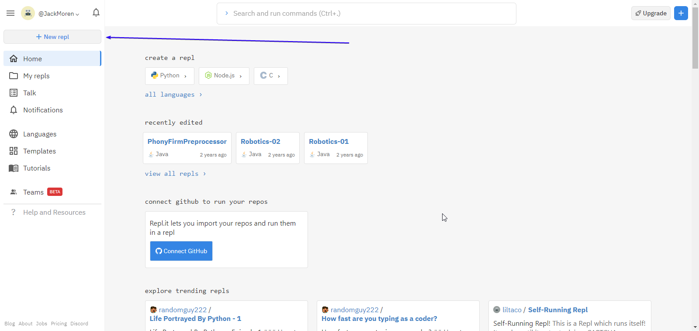

# Table of contents
1. [Introduction](#introduction)
2. [Resources](#resources)
3. [Basic Java](#basic-java)
	1. [Intro](#java-intro)
	2. [Getting started with an IDE](#getting-started-with-an-ide)
	3. [Hello World!](#hello-world)
	4. [Compiler errors](#compiler-errors)
	5. [Variables](#variables)
	6. [Naming variables](#naming-variables)
	7. [Arithmetic operations](#arithmetic-operations)
	8. [Assignment operations](#assignment-operations)
	9. [Other variable types](#other-variable-types)
	10. [User input](#user-input)
	11. [Comments](#comments)
	12. [If statements](#if-statements)
		* [What is a boolean statement?](#what-is-a-boolean-statement)
		* [Comparison operators](#comparison-operators)
	13. [Else if statements](#else-if-statements)
	14. [Else statements](#else-statements)
	15. [For loops](#for-loops)
		* [Variable initializattion and declaration](variable-initializattion-and-declaration)
		* [Looping condition](#looping-condition)
		* [Variable manipulation](#variable-manipulation)
    16. [Strings](#strings)
    17. [Arrays](#arrays)
        * [Why do arrays start at 0?](#why-do-arrays-start-at-0)
4. [Object Oritented Programming](#object-oritented-programming)

# Introduction
Welcome! This is a coding guide all the way from basic Java to vision code intended for FRC students, specifically those for Sargon Robotics team 2335 with little to no prior programming experience. My name is Jack Moren, I was the head programmer of the team from 2016 to 2019. Before my arrival, there was not a lot to learn from, with the FRC wiki being spotty at best and there only being one other programmer there wasn't a lot of time for me to learn. Additionally, our team wasn't too advanced in programming, so I had to learn a lot on my own. To preserve all I learned, I decided to write this guide. This is the 2.0 version, the first one being lost by SMSD erasing my Google Drive. Additionally, with there being a decent gap in FRC because of the pandemic, I figured it would be nice to have this all written down so when the robotics seasons continue, there's a good starting place.

# Resources
Before we get started I want to make a section full of recourses you can use to look things up:

First and foremost, if you don't know something, don't feel bad, Google it! As someone who has been coding for over 7 years, I still google things constantly like "how to round a number in Java" or "how to create a timer in Java" it's not shameful to look things up.

Second, when it comes to robotics stuff, look at [WPILIB](https://docs.wpilib.org/en/stable/), this is the home to coding for robotics. It tells you how to install all the FRC software, how to reimage the roboRIO, how to program the radio, and much more.

For documentation, everything in the [WPILIB libraries](https://first.wpi.edu/FRC/roborio/release/docs/java/index.html) is really well documented. We'll talk more about documentation later but for now you can look up any class you need to use and get all the methods as well at what they do.

The last bit I'll give, if you're confused about something, feel free to open up an issue on this repository. To do that, go to the top of the github page while looking at this repo (you should already be there) and click on the issues tab:
Side note: if the pictures here are too small for you to see, just click on them, it'll open it up in a bigger size


Then click where is says `create new issue`:


Feel free to leave any concerns there, I'll respond as soon as possible!

# Basic Java
## Java Intro
The first set of topics we're going to cover is the basics of the Java programming language. As of my time leaving, there are three official supported languages: Java, C++, and Labview. I chose to have the language for our team be Java, this is for several reasons. This is not because I specifically like Java over the other two, but for learning it's the best decision to start off with. C++, while being very similar to Java, is much more complicated. C++ requires you to work a lot more in depth, which can have many benefits, but it also requires a lot more code for the same actions, and with the limited time avalible to learn before the build season, that's not something I want to mess with. I also chose not to use Labview because simply it's not a real coding language. Learning Java can help you if you wish to further pursue programming, like creating a Minecraft mod, a website, or pursue a computer science degree. While Labview is used in the field, it's for specific products made by National Instruments and is much more limited. Furthermore, learning Java will teach you coding, Labview will teach you Labview, especially when it will come to vision coding I believe learning how a program works on a fundamental level is much more important.

## Getting started with an IDE
Before we jump into coding we need to have the software.

> But why do I need software to write code?

I hear you asking, well writing code you can do even on paper but we need software to run it. When a programmer like you writes code, the computer can't understand it directly. What's the point of writing the code then? Well something the computer **can** understand don't make any sense in English. The point of the code we will write is that it can easily be turned into something the computer can understand using a `compiler`. A compiler is a piece of software that turns our code into an executable file, which we can run.

So which one do you choose? If you look up `Java compiler` you'll probably find tons and tons of different ones, and they all have their own nuances. For robot coding, there will be a specific one you should download, but for basic Java I recommend using [repl.it](https://repl.it) because you don't need to install anything! It's all online! All you need it to make an account, start a new file and make sure it's using Java, then press the `run` button.

Create a new file:


Select Java:

You can give what ever name you like for the file, but I'd recommend something you can look at later and know what you were working on. While the default names can be funny, they're not practical when you're trying to find when you were learning about functions, for example.

## Hello World!
Finally, we can start coding! When you open up your file you'll notice there's already a program written in there. My interface might look different from yours, that's because I have `dark mode` turned on, don't worry though other than my eyes hurting less, there are no other differences.

If you press the run button on the top, your program will run on the left, you'll notice the program outputted
> Hello, world!

This is tradition for learning a new programming language, your first program is always something that just prints out "Hello, world!"
Now you're a real programmer! Well not quite, because as I'm sure you've figured out you didn't write any of that. There are seven lines in this program and you probably have no idea what any of it means.

So where do we start? Let's begin from line 1:
```Java
class Main
```
This isn't going to mean much to us until we get further down the line, but right now all you need to know is that Java requires a "main" class to function. It's where your main method is.

I can already hear you asking:
> What on earth is a main method?

Well a main method is required for any program to run, it's the method that the code starts running at. Why is this important? Well eventually we will have a lot of different methods all over the program, but the method called `main` is always the one Java starts at. 

Now you're probably wondering about the curly brackets, the `{` and `}`. Those are used as wrappers. After the first line, we open the curly brackets, and everything inside them is what the class called `Main` contains. Anything outside the last closing bracket isn't in the main class, and Java will probably not like. Same thing goes for the main method, the curly brackets after
```Java
public static void main(String[] args)
```
are just what is contained inside of the main function. I understand for now that block of code is really confusing, what do all those words mean? There's a lot of them and I only really understand `main`. Trust me, we *will* get there, but you just have to trust me for now and understand that all that means is it's the main function. The last line of intrest is inside the main function:
```Java
System.out.println("Hello, world!");
```
Again, what does all of it mean? I promise it'll make more sense down the line, but right now you just need to trust me that this is how you tell Java to print something into the console.  There is one thing I need to mention about this line, the semi-colon at the end of the line. We will see this a lot in programming, and it'll be all over the place, so what does it mean? A semi-colon goes at the end of every program statement, it's to tell the compiler that the line is done. The compiler doesn't like to read white space because it wastes time, so spaces and new lines aren't read, humans can easily see that it's the end of the line, but the compiler ignores all the empty space. This is why we end our line with a semi-colon. What is a program statement? Well that's a really long list, it's easier to talk about what *isn't* a program statement. In this example, the method and the class aren't program statements, but printing out is. If you're not following, don't worry, we'll cover this more later. A good rule of thumb for now is that if it involves curly brackets, you don't need a semi-colon.

Now, go ahead and try it yourself, have it print whatever you want! All you need to do is follow this format (don't forget the semi-colon :) ):
```Java
System.out.println("Put whatever you want here inside these quotation marks");
```
Congratulations! You are now a *real* programmer! You have just completed exercise one!

## Compiler errors
One thing I would like to mention is compiler errors, because soon you'll start to experience them for yourself. Compiler errors are, well you won't believe this but it's when a compiler runs into an error and can't understand your code. The nice thing here is that usually the compiler will tell you exactly where your error is. I've gone ahead and created an intentional error to show you what a compiler error will look like:

You can see at the end it's told me there was an error, and it exited the program. The actual error is just above and looks like this:
```
Main.java:5: error: ';' expected
    System.out.println("Hello world!")
                                      ^
```
This gives you a lot of information, let's discect this bit by bit. The first bit of the error is `Main.java:5`, now if you look on the left, my file is called `Main.java`, meaning that the first part is telling me what file to look at. After that it shows us exactly what line it's on, but it does it in 3 different ways. First there's the `:5` after the file name, which if you look at the code itself, is currently highlited. Now we know where the error is about, but what is the error? Well the compiler was also nice enough to tell us `error: ';' expected`. Remember when I said semi-colons were important? We forgot one here, and the compiler is letting us know. Finally, just incase you were still lost, you can see the compiler is pointing to the end of our `System.out.println("Hello world!")` line, and showing us exactly where it thinks the semi-colon should go. There's probably a question stirring around right now:
> If the compiler can show me exactly where my error is, why can't it just fix it for me?

Well the sad answer is it's not always that easy, sometimes the error is more complicated that a missing semi-colon, or sometimes the compiler thinks it's a semi-colon missing but it's a different problem entirely. Simply put: the compilter isn't perfect, but it can point us to where the error is so the people writing the code can sort the problem out.

One very important note, the error won't always be as simple as a missing semi-colon. Sometimes it will say something like `NullPointerException` or `IndexOutOfBoundsException` which won't tell you anything more. If you encounter an error like this and you don't know what to do, don't give up! If you ever encounter an error you don't understand fully, look it up! There are many websites where other coders have probably asked similar questions. This isn't an exam, you're allowed to look stuff up, it doesn't make you any less of a programmer.

## Variables
Ok now we can print! So what now? Well that's the thing there's a lot of places to go from here, and it may not all make sense, but the first place I'll take you is the land of variables. No wait come back, I promise this isn't your math class, variables in programming are much different. We're going to start with the most basic variable type: an integer. I know I promised no math but this is as complex as it gets in this section. If you remember from your math classes, an integer is a number with no decimal value, it's a whole number, it's the same in programming. An integer type variable is a positive or negative variable of any number, as long as it's a whole number. Now let's get to actually using variables, this is the structure for declaring a variable.
```Java
int number;
```
We now have a variable! We have a variable named `number`, it's important to note that you can name a variable whatever you want. Well, not whatever you want, unfortunately there are some rules for naming variables. but we'll get to that later, for now just use `number` like I am. 

So what do we do with it? Well let's set it to something so we can store it for later. Let's actually assign the variable to something. Pick a number, any number that doesn't have a decimal place, just keep it classy please, this is a school activity. Let's now set the variable to that number on a new line:
```Java
number = 5;
```
This is what's called `assigning` or `initializing` the variable. When you set a variable, you're `assigning` it to a value. In this case, we assigned it to 5. This means if we try to access `number` anywhere else in the code, it will give us the number 5. An important distinction between `assigning` and `initializing`: the variable is only `initialized` when it's first `assigned`. This is because before we first set it to a value it doesn't have a set value, so if you tried to read it, it would probably just give you some random number. So the first time you give it a value, it's `initialized` and now we can use it properly. That being said, you can always `assign` the variable to something else if you need to.

So let's go use that variable now, let's try to get it to print out. Before reading further, try to get your program to print out our variable. It's ok if it doesn't work, I'd just like you to try.

Now my guess is, if you tried to print it out, your first guess may have been something like this
```Java
System.out.println("number");
```
But as you noticed, this won't work. Why is that? We wrote number in, so it should work right? That's a completely fair assessment, but `"number"` is what's called a `literal`, in this case since it's a `string` (don't worry, this will be talked about more later) it's call it a `string literal`. What this means, is it's not a variable, it's a value, Java sees `"number"` as **literally** the word `number`, and not the variable. So how do we fix this? We need to remove the quotation marks.
```Java
System.out.println(number);
```
This will now successfully print the number you stored in! Keep in mind, you still need the other lines of code we had before, your whole code should look something like this
```Java
class Main
{
    public static void main(String[] args)
    {
        int number;
        number = 5;

        System.out.println(number);
    }
}
```
You can now create and assign numbers. You might be asking what is the point of a variable? Why not just write in 5? Well sometimes we get variables from input from a controller for example, and we need to store those numbers to use later in the program. We'll be getting to input really soon actually.

## Naming variables
Before we move onto the next section, we should know how to name variables. Remember when I said there were rules, well there are specific things you can't do when naming variables. 

There are two main types of rules when it comes to naming variables: there's rules set by the Java compiler (your code won't run), and naming conventions that you *can* break, but it makes you code less readable

Let's talk first about the explicit rules set by Java:
* Your variable name must begin with a capital or lowercase letter, a dollar sign ($) or an underscore (_) (underscore is the character you get when you press the minus key while holding shift)
* After the first chracter, you can use any combination of characters
* You cannot use a keyword as a variable name
* Names are case sensitive

Here are some examples of valid variable names: `_motor $speed and sensor` and here's some illegal names `1st_motor -speed %onTarget`

There are also different kind of naming conventions. These aren't hard rules like the last one, these can be broken. You can not use any of these styles in your code and it will run just fine. However, when other people are reading your code, you don't want them questioning which variable does what.  First, when you name a variable, **it needs to be named based off what it's being used for**. While, sure, you might be able to remember what `number1, number2, number3 and number4` are all used for, this is a team effort. Other people *will* be looking at your code, including you long after you forgot what those variables were all for. Therefore, when naming a variable, we choose a name based off what we're using it for. That way if we see a variable called `frontLeftMotorSpeed` we know exactly what it is, it's the speed of the front left motor, and we don't have to go looking for where we assigned it to see what it does.

That being said, there are still naming conventions, you'll notice how I capitalized my variable `frontLeftMotorSpeed`, this is because to most people it's much easier to read that as `frontleftmotorspeed`, being that variables can't have spaces, we need to find a way to easily separate the words. There are many conventions out there, and I'll list the most popular ones:
* Cammel case: frontLeftMotorSpeed, this is the one I used in my example, the first word is lowercase, but the first letter of every added work is capitalized
* Pascal case: FrontLeftMotorSpeed, very similar to cammel Case, except the first letter is capitalized
* Snail case: front_left_motor_speed, a little different, here the words are all separated by underscores
I recommend you use cammel case because it's what both Java, and WPILIB use in their variables. If you prefer one style over the other, that's fine, but I want to remind you that having differently styled variables in different areas makes the code look like a mess, which is why I recommend everyone for their robot and Java code to use cammel case.

## Arithmetic operations
Now we can store values, which is nice but what can we *do* with it? Well the first and obvious thing is we can use math to mess with the variables. They're are called `arithmetic operators`, we can use these in terms of `number literals` or other `variables`. The first set should all be operators that you're familiar with:

Operator	|	Description
-----------	| -------------
\+ 			| addition 
\- 			| subtraction
\* 			| multiplation
/ 			| divition
% 			| modulus (explained more below)

Additionally, the basic order of operations (PEMDAS) still applies in pretty much all coding languages, and if you need to use parentheses in your math you can add as many as needed. The last operator is a little more complicated than your regular math operators. The `modulus` operator (%) returns the remainder of a division, for example, 5 / 2 is 2.5, or 2 with a remainder of 1, so 5 % 2 would return the value 1.

## Assignment operations
Now math isn't the only thing we can do with variables, as seen before we can also assign them. You're already faimiar with the basic assignment operator `=` but there are more believe it or not. Sometimes you want to add a specific number to a variable. Let's say you're making a program to track how many times the robot has spun in a full circle, you'd want to add 1 to the variable, so how do we do this? Way back before fancy assignment operators, we had to type this out:
```Java
spinCount = spinCount + 1;
```
Hopefully you see how this works, you take the `spinCount` variable and set it to itself plus 1. But, programmers are lazy. This was too much typing, so later they came up with these assignment operators, that are shorthand, or just a shorter way or writing the above expression:
Operator	| Description											| Example
-----------	| ----------------------------------------------------- | -------
+= 			| this sets a variable to itself plus a number			| `number += 5;` is the same as `number = number + 5;`
-= 			| this sets a variable to itself minus a number			| `number -= 5;` is the same as `number = number - 5;`
*= 			| this sets a variable to itself multiplied by a number	| `number *= 5;` is the same as `number = number * 5;`
/= 			| this sets a variable to itself divided by a number	| `number /= 5;` is the same as `number = number / 5;`

The last two are a little bit more unusual, but because programmers like to add one to a variable so often, we created an even smaller shortcut for that
Operator	| Description										| Example
-----------	| ------------------------------------------------- | -------
++ 			| this adds one to a variable, or `increments` it	| `number++;` is the same as `number += 1;` or `number = number + 1;`
-- 			| this adds one to a variable, or `decrements` it	| `number--;` is the same as `number -= 1;` or `number = number - 1;`

## Other variable types
So you probably noticed a problem with the division operator, what if we want to store a decimal value? Or what if we want to store something that isn't a number? Well lucky for you there are more variable types than integers. Declaring and initializing variables is always in the same format of
```Java
[variableType] variableName = [value];
```
Or as an example:
```Java
double circleRadius = 5.4;
```

What does a double mean? I'll get to that in just a second, but every variable type works this way. I'm going to start with variables that store numbers:
Operator	| Description
-----------	| -----------
int 		| you've seen this one already, but it stores a whole number integer, positive or negative
float		| this is called a "floating point" number, I could get into the specifics of why it's called that but for now I'll just say that it holds a positive or negative with 32 significant digits (if you don't know what that means, take it as it can store 32 individual numbers, so if a float was 52.X that X could be up to 30 numbers long). It has about the same range as an integer
double		| this is called a "double precision number," this is because it has twice the precision as a float, and can store 64 significant digits. The range is approximately the same, but it can store a lot more information. That does come at a cost though, because it takes up twice the amount of space.
boolean		| this is a very different type of variable, it only stores two values: 0 or 1, we represent those in Java as either `true` or `false`, you might think there's not much reason to use a boolean, but I assure you they show up everywhere in programming

There are two other types of variables that we will use, but I wanted them in their own category. There are variables we can use to store letters and words, those are below:
Operator	| Description
----------- | -----------
char		| char is short for character, it can store a single character, which is to say a single letter, number, or symbol, we usually surround those in single quotes like 'a' or '+'
string		| you've seen these before, remember when we did `System.out.println("Hello, world!");`? Well "Hello, world!" is a string, it's like a sentence, it's called a string because it's viewed as a `string of characters`. As you've seen before, strings are surrounded in double quotes.
We will cover strings and chars more later, but I thought it would be important to at least have those out there.

This isn't a full and complete list of number variable types, there's stuff like `short` and `long` or even `unsigned` numbers, but frankly I never used those even outside of robotics coding, so I'm going to cut the list here. Also, there are other variable types that store numbers, but for now I just want to stick with these so you can familiarize yourself with them.

## User input
Now as interesting as it is to assign the variable yourself, but what if instead every time we run the program we can give it a different number? Normally, with most languages you cover this in the beginning, but unfortunately, Java makes it a little complicated, and I didn't want to scare anyone off. Let's try and make a program that takes a number, and gives us the negative of that number. Now I'm going to give you a few lines of code, and they won't all make sense, but you just need to trust me for now, it will make more sense later.

The first thing you want to do, is add this line to the very top of your code (above `class Main`)
```Java
import java.util.Scanner;
```
I'm going to be saying this a lot in the beginning, but you just need to trust me for now, I promise later I will explain this line properly, but you need this to be able to get user input. Next, add this to the beginning of your main function (right after the open curly bracket { for the main function)
```Java
Scanner scanner = new Scanner(System.in);
```
Yeah there's a lot here, and not all of it makes sense, but just ignore this for now if possible. This just set it up so we can actually get user input. The next thing we want to do you should be familiar with, print out a line that asks the user to type in a number. Just incase you forgot what that would look like, let me show you here:
```Java
System.out.println("Please give a number: ");
```
Now the only thing left to do is actually get the input. So considering we need to store this somewhere, we should create a variable for it! Go ahead and go to the next line and `define a variable`, don't set it to anything just yet. It should something like this:
```Java
int userInput;
```

Now that we've defined the variable we'll initialize it. We need to give it a value, that value will be the user input that they type into the console. To do that, we do something similar to when we printed the output, add the following after the variable declaration:
```Java
int userInput = scanner.nextInt();
```

If you wanted to get a double, or a float, it would look like the below code. This will be pretty much the same for any variable type.
```Java
double userInput = scanner.nextDouble();
float userInput = scanner.nextFloat();
```

You'll notice I defined, and initialized the variable on the same line, this is something you can do, so I thought I would show it off just for clarification.

Now we have their user input stored in our variable! Let's do something with it. Let's give back the number squared. Go ahead and try it yourself, there's two ways you can do it, you can make a new variable and store the number squared there, then print out the squared variable. You could also just square the number inside the print statement.

One more thing I would like to note: you can get input as many times as you want, there's not a limit. If you wanted to get two numbers, all you need to do is make a new variable. I normally like to print out asking the user for what specifically I'm looking for before getting input, but it's not required.

<details>
	<summary>Here is what it should look like:</summary>

	```Java
	System.out.println(userInput * userInput);
	```
</details>

Now we're really close, but you might notice repl shows a little warning that we need to close the scanner. You can leave it alone, but at the very end I would add this line:
```Java
scanner.close();
```
Again, I know this doesn't make a ton of sense, but all you really need to know is that this closes the input reader properly before the program quits.

In the end, your program should look something like this:
```Java
import java.util.Scanner;

class Main
{
    public static void main(String[] args)
    {
        Scanner scanner = new Scanner(System.in);

        System.out.println("Please give a number: ");
        float number = scanner.nextFloat();

        System.out.println(number * number);
        scanner.close();
    }
}
```
Look at that! We're getting somewhere! I think you know enough to where I can direct you to the exercises. 
I'm too tired to continue, keep writing about how to access the exercies and then write the first one 

## Comments
Hopefully you've done your first exercise by now, and hopefully it wasn't too bad, there is one thing I'd like to talk about before we continue with coding concepts, and that's comments in code. You'll notice in the solution I wrote something like:
```Java
// You can use a float here too
```

Now maybe you figured this out already but you can leave notes in your code! It's really nice because as long as you put the right symbols before (I'll show you in a second) you can put whatever you want. I just wanted to clear this up because if you look at any of the previous robot code that I wrote, comments will be **everywhere**. As they should be for your code as well, comments are a really good way of describing what's going on, so if someone else is looking over it they don't get lost. Especially when learning something new, it's nice to leave notes for yourself so you can go back and look later. Leaving comments on your code is part of what's called `good documentation`, which is just a fancy way of saying you can easily understand someone's code if you weren't the one who wrote it. The other big part is naming your variables, which we've already talked about!

As for leaving a comment, it's really simple:
```Java
// Two slashes starts a single line comment, you can't type any code on this line, and the next line will act as code again
int num = 5; // If you put the slashes after a program statement
// your comment can even be on the same line, but you can't do the opposite, no code can be written past those slashes

/* A slash followed by a star is the start of a multi-line comment
   this comment will expand through multiple lines, it's really helpful if you need to take out a big chunk of code
   everything inside the multi-line comment will not be read as code by the compiler
   the only way to end the commend is with a star and a slash, just like this: */
```

## If statements
Now we're starting to get into some of the interesting stuff, there are a lot of cases when programming when you only want to run a section of code *if* a condition is true. For example: let's say you're coding the robot, and you don't want a specific motor to ever go backwards. Shouldn't there be a way to make it so if the input from the controller is negative, we don't move the motor? Well yes! There actually is! 

Since that example may have been a little too out there, let's back it up to where we are in terms of writing programs. Let's use the first exercise as an example, there was no way to stop the user from inputting any negative numbers, you'll notice if you put in a negative number, it would give you a negative area, which isn't exactly possible. So, how can we stop that? We use this thing called an `if statement`. An `if statement` will have three main parts: the declaraction of the `if statement`, the `boolean statement` or the condition and then the program statements to run if the condition is true.

### What is a boolean statement?
Remember the `boolean` variable type? If not here's a quick refresher, it's a value that either shows up as `true` or `false`, which can also be represented as 0 (false) or 1 (true). A `boolean statement` is a statement that will evalulate as either 0 or 1, just the same as a boolean. So what exactly makes a boolean statement? Well we can use `comparison operators` to make boolean statements

### Comparison operators
I bet you thought you were done with operators, not quite. This last set is really easy, it's just comparing two values, this will either be a `variable`, or a `literal` value. Here is a list of comparison operators:

Operator	| Description
-----------	| -----------
== 			| the equals operator, it checks if the actual values of both sides are equal to each other, remember that just one = sign is the assignment operator
!=			| not equal to, this is the opposite of the equals operator
<			| less than, this one, as well as the rest will hopefully speak for themselves
\>			| greater than
<=			| less than or equal to, please note that the equals sign *has* to come after the <, meaning you can't type "=<"
\>=			| greater than or equal to, the order is just as important as it was for the other ones

There are also ways to check several conditions at once:

Operator	| Description
-----------	| -----------
&& 			| this is the AND operator, it checks if the condition to the left, AND the condition to the right are true
||          | this is the OR operator, it checks if the condition to the left, OR the condidion to the right are true

You can use as many ANDs and ORs as you want, and just like with arithmetic operators, you can use parentheses to tell the compiler what you want to check first.
To give an example, let's say I wand to see if a number is in between 1 and 10, I would use:
```Java
num > 0 && num <= 10
```
You could also have `num >= 1` or `num < 11` it doesn't matter, but this is just a quick example to show you how they work. 

That's it! That wasn't so bad, was it? Now that we have the comparison operator, let's take a look at an example `boolean statement`. Let's keep using this example of negative numbers. Let's say we have a variable called `userInput`, and it is a number, doesn't really matter what type. To see if it's negative, all we need to do is check if it's less than zero. See if you can write out what the boolean statement will be before looking at it.

Here is what that boolean statement will look like:
```Java
userInput < 0
```

Really not so bad, is it? Now you'll notice that I didn't put a semi-colon at the end, that's because this will end up going inside the if statement, so I didn't bother to put one in. Now let's go ahead and take a look at the anatomy of an if statement (please note that [] just denotes where things should go, and they they're not real values, YOU WILL NOT BE USING [] IN JAVA, not for a while at least)
```
if([boolean statement])
{
	[what to do if the boolean statement is true];
}
```

Let's go ahead and continue with our previous example of getting rid of negative numbers. If we want to turn a negative number into a positive one, what to do we? There is the absolute value, but let's pretent that doesn't exist in Java (it does, but I'm going to stay away from it for now). Using the operators we know, how can we turn a negative number into a positive one? Well the easiest way I can think of is to do the following:
<details>
	<summary>Click here for the answer</summary>

	```Java
	userInput *= -1;
	```
</details>
All we need to do is set `userInput` equal to itself, but multiplied by negative one. Those of you who remember from math, a negative number times a negative number is a positive one. And any number times 1 is itself, so this will do exactly what we want. I want you to go ahead and try writing that out now to see what it might look like. You have every part you need, you just need to put it together.
```Java
if(userInput < 0)
{
	userInput *= -1;
}
```
Here is exactly what it would look like. You're probably asking yourself about the semicolon, where it is? Well an `if statement` isn't a program statement, it's a condition. We're setting up a condition to run, what's inside the `if statement` *is* a program statement, which is why we need semicolons. Additionally, you have have as many lines as you want inside the `if statement`, as long as they're surrounded by the curly brackets `{}`.

Now you know about if statements! To show you what the whole program would look like with the if statement added, I'll show it below:
```Java
import java.util.Scanner;

class Main
{
    public static void main(String[] args)
    {
        Scanner scanner = new Scanner(System.in);

        System.out.println("Please enter a number:");
        double userInput = scanner.nextDouble();

        if(userInput < 0)
        {
            userInput *= -1;
        }

        System.out.println(userInput);
        scanner.close();
    }
}
```
Before I end this section, I'd like to point out where I put the if statement, I put them after `userInput` was assigned, and before it printed. If I put there if statement after the print, then the number would still be negative. While yes, at the end of the program the numbers would no longer be negative, the unfortunate part is we'd print before we changed them back to positive.

## Else if statements
I'm going to give you a quick idea for a program, I want you to tell me is a variable `motorSpeed` (for right now just make this from console input) is positive, negative, or zero. This on a robot would correspond to if the robot is moving forward, backward, or isn't moving at all. You don't need to write it, this isn't a full exercise, but I encourage you to practice. 

<details>
	<summary>It should look something like this:</summary>

	```Java
	import java.util.Scanner;

	class Main
	{
		public static void main(String[] args)
		{
			Scanner scanner = new Scanner(System.in);

			System.out.println("Please enter a number:");
			double motorSpeed = scanner.nextDouble();

			if(motorSpeed > 0)
			{
				System.out.println("The robot is moving forwards"); 
			}

			if(motorSpeed == 0)
			{
				System.out.println("The robot is not moving");
			}

			if(motorSpeed < 0)
			{
				System.out.println("The robot is moving backwards");
			}

			scanner.close();
		}
	}
	```
</details>

This is perfectly correct, but there's some problems with it. The problem is `effeciency`, this code will run, but let's say `motorSpeed` is less than 0, and the robot is moving backwards. You'll notice that even if the robot is moving backward it will check if it's still, and then if it's going forwards. While just this running one time isn't that bad, what if this bit of code was looping multiple times a second? Just like it would during the robot code. What we want is a way to have it not check the other two conditions as long as the first one is true. Well lucky us, that's exactly what an `else if` statement is.

An `else if` statement looks very similar to an if statement, with one key difference. There **has** to be a normal `if statement` before it. You cannot have a lingering `else if`. This is because of how they behave, if your `if statement` returns false, any `else if statements` attached to that `if statement` will be ignored, since it can only be one or the other. If you have a chain of `else if statements` (because you can add as many as you want), as soon as one of them evaluates as true, the other ones will be ignored. The way you write an `else if statement` is like this:
```
else if([boolean statement])
{
	[what to do if the boolean statement is true];
}
```

Let's take the program above, and this time we will use `else if statements`:
```Java
import java.util.Scanner;

class Main
{
    public static void main(String[] args)
    {
        Scanner scanner = new Scanner(System.in);

        System.out.println("Please enter a number:");
        double motorSpeed = scanner.nextDouble();

        if(motorSpeed > 0)
        {
            System.out.println("The robot is moving forwards"); 
        }
        else if(motorSpeed == 0)
        {
            System.out.println("The robot is not moving");
        }
        else if(motorSpeed < 0)
        {
            System.out.println("The robot is moving backwards");
        }

        scanner.close();
    }
}
```

Now, if we run this, it will check at minimum only one condition, but it can still go through and check all three. If `motorSpeed` is 10 for example, the first `if statement` will return true, and the others will all be ignored. But if it's -10, then it still has to evaluate the first, second, and third boolean statement. This is why ideally, at the top (the regular if statement) you would have the one that's going to return true most of the time. I think it's safe to say a majority of the time during a match our robot will either be still, or moving forward. Congratulations! You know know `else if statements`.

## Else statements
In the circumstances we set up above, there's only 3 possible conditions for our `motorSpeed` value when we're comparing it to 0. Ignoring imaginary numbers, because dear God, please don't make me think about those (also Java doesn't really do those super well as far as I know), `motorSpeed` can only be less than, greater than, or exactly equal to 0. That being said, if our `motorSpeed` variable fails the first two conditions of `motorSpeed > 0` and `motorSpeed == 0`, then it **has** to be less than 0. If that's the case, then why do we will check for it? We still make the computer do the evaluation of `motorSpeed < 0` because we wrote out the comparison operation, but if we get to that last block, we know for a fact it's going to be true. This is where `else statements` come in.

An `else statement` is really easy as long as you understand the `if` and `else if statements`. But like the `else if statements`, `else statements` have special rules. You can only have **one** `else` for each block, unlike `else if` where you can have as many as you want, for an `else` we can only have one condition that's true if none of the others are. That being said, it's logical that the `else statement` has to be at the end, because it's sort of a last resort. Additionally, you cannot have an `else statement` by itself, it has to be attached to an `if`, much like an `else if` does. We only go to the `else statement` if the `if and else if statements` are all false. An else statement also does not need a `boolean statement`, it looks like this:
```
else
{
	[what to do if the boolean statement is true];
}
```

Pretty simple, no boolean statement required. Let's go ahead and take the example from the last section, but use an `else statement`:
```Java
import java.util.Scanner;

class Main
{
    public static void main(String[] args)
    {
        Scanner scanner = new Scanner(System.in);

        System.out.println("Please enter a number:");
        double motorSpeed = scanner.nextDouble();

        if(motorSpeed > 0)
        {
            System.out.println("The robot is moving forwards"); 
        }
        else if(motorSpeed == 0)
        {
            System.out.println("The robot is not moving");
        }
        else
        {
            System.out.println("The robot is moving backwards");
        }

        scanner.close();
    }
}
```
In this case, if we find that `motorSpeed > 0` is false, and `motorSpeed == 0` is also false, then `motorSpeed` **has** to be less than 0, which is why we have an alse statement. This way, the maximum amount of conditions we will need to test is now two instead of three. You won't always have an `else` or `else if` with your `if statements`, but they certainly help move things along much faster.

You're now ready for exercise two! Go ahead and go to the exercies folder and try out the second exercise.

## For loops
There are often time when you want to do a specific action several times. Sometimes it will be a specific number of times, others it will be until a specific action is complete. For that, we use `loops`. I thought about not even making sections on `loops` but they're important to coding outside of robotics, an they teach some good concepts, but I would like to stress that while coding robots for First Robotics, you will rarely, if ever use `loops`. I went and looked back at what I think is the best robot code I had, which was the 2018 Power Up season. There is not a single loop in the code. It's generally a good idea not to use `loops` in the robot code, this is because the robot code `loops` itself, so writing `loops` inside that scheduled looping code would require the whole robot code to stop and wait for that `loop`. That results in some really weird, or really slow behavior, which isn't what we want. But like I said before, loops are important when not writing robot code, so I'm going to cover them, just not as in depth.

The first type of loop I'm going to cover is a loop where we know how many times it needs to run. Either we set a constant number like "run 10 times" or we use a variable like "run x times". Let's say I asked you to write a program that finds the n-th power of 2. With n being a number given by the user. Hopefully you know what that will look like by now, and if you want more practice I encourage you to start a program where it asks for a number from the user.
<details>
	<summary>It should look something like this:</summary>

	```Java
	import java.util.Scanner;

	class Main
	{
        public static void main(String[] args)
        {
            Scanner scanner = new Scanner(System.in);

            System.out.println("What power of two do you want? ");

            // We're using an int because 2^(2.3) isn't really easy to do, so let's stick with whole numbers
            int powerNum = scanner.nextInt();

            // TODO: get the powerNum-th power of 2

            scanner.close();
        }
	}
	```
</details>

Now it's time for the for loop. There's three main parts of the `for loop` statement. There's the `variable initializattion and declaration`, the `looping condition`, and the `variable manipulation`. I should note these aren't official, I am just calling it that. You're familiar with all these sections, so all you need to do is figure out how to apply them to for loops.

### Variable initializattion and declaration
For loops entirely rely on something called an `iterator` variable. Iteration just means "to do something over and over, usually to improve." So the `iterator` variable keeps track of not only where the loop starts, when it ends, how it changes, and where we are in the process of looping. For this part all we need to do is declare and initialize an `iterator` variable. We usually use `i` which is of course short for `iterator`. Since we can't do half a loop, we'll use an int. It should look something like this:
```Java
int i = 0;
```

Why 0? Why not 1? Well later that will make more sense but for now, just use 0 at the start of for loops. There will be scenarios where it makes more sense to start at 1 or maybe 2, but for most cases (including this one) it'll be 0.

### Looping condition
This is just a `boolean statement` stating when we want to keep looping. When the `boolean statement` returns true, it keeps looping, when it's false, it stops. Given we want to loop `powerNum` times, we want to go until our `iterator` reaches the same number as `powerNum`. This should look like this:
```Java
i < powerNum;
```
This means that while our `iterator` is less than powerNum, it will keep going through the loop. It starts at 0, and once it's run `powerNum` times then `i` and `powerNum` (assuming we add one each loop). So at that point `i` and `powerNum` are the same, and `i < powerNum` will be *false*, stopping the loop.

### Variable manipulation
At the end of the loop, we want to change our `iterator` variable somehow. Given that we assumed above that we want to increase by one, we're going to `increment` our `iterator` after each loop.
```Java
i++;
```

Now that we have all the parts, here's what a for loop will look like:
```
for([variable initialization and declaration]; [looping condition]; [variable manipulation])
{
	[what to do in the loop];
}
```
It's that easy! You just plug in those three parts and you have your loop. You'll notice each part is separated by a semi-colon. This is because they're each their own `program statement`, and the compiler has to be able to tell one apart from the other.

Using what we have go ahead and try to write out the for loop we'll use for finding the powerNum-th power of 2.
<details>
	<summary>This is what you should have: </summary>

	```Java
	for(int i = 0; i < powerNum; i++)
	{

	}
	```
</details>

As for what to put inside the for loop? Well I think we should create a variable to store what the final result will end up being. One important note, **do not create this variable inside the for loop**. What this will do is every single time we loop, it will reset the variable to the value we give it, so it won't ever change. So before the for loop, let's create a int for it (powers of two won't be decimals, so we'll use an int):
```Java
int result = 1;
```

Why do we set it to 1? Well let's think about the strange cases, any number to the 0th power is one, so let's talk about is `powerNum` is 0. In that case, we will get to the for loop, it'll set `i` to 0, and check if `i < powerNum`. Since they're both 0, this is the same as `0 < 0`, which is false. This means the loop will not run, and the final value of `result` will be 1. If they type in 1, it'll multiply 1 by 2, and we'll have 2. Similar with higher powers. Now all we need to do is multiply result by 2 each time we loop, and print out the result. Go ahead and try that out.
<details>
	<summary>It should look something like this:</summary>

	```Java
	import java.util.Scanner;

	class Main
	{
        public static void main(String[] args)
        {
            Scanner scanner = new Scanner(System.in);

            System.out.println("What power of two do you want? ");

            // We're using an int because 2^(2.3) isn't really easy to do, so let's stick with whole numbers
            int powerNum = scanner.nextInt();

            int result = 1;

            for(int i = 0; i < powerNum; i++)
            {
                result *= 2;
            }

            System.out.println("2 to the power of " + powerNum + " is: " + result);
            scanner.close();
        }
	}
	```
</details>

My print line probably looks a little funny, you can have a string literal with variables in the same print statement? Well yes, all you need to do is add them to the string. Adding strings isn't like adding numbers, so if you add "Hi there!" and "my name is Jack." The result will be "Hi there!my name is Jack." (that's also why I have spaces in somewhat weird looking spots). You can also add any variable type to a string, and it'll treat it as if it were a string. So if we input 5, this should say "2 to the power of 5 is: 32" which is infact 2^5.

## While loops
What if we don't know how many times we want to loop? Let's use our previous program, if they put in a negative number it will way 1, which we know isn't true. Let's set up a loop that will ask for input until they give a number that isn't negative. In this case we will use a `while loop`. These are much less complicated, the only thing you need is a `boolean statement`. When this `boolean statement` is `true`, it will continue looping, when it's `false`, it stops the loop. Let's take a look at the structure of a `while loop`:
```
while([boolean statement])
{
	[what to do in the loop];
}
```

One thing that needs to be said, the variables you use in the `boolean statement` for your loop need to be changed. You *really* want to avoid something called an `infinite loop`. This is when the `boolean statement` in the while loop will always be true. This will completely stop the program from running, since it's still trying to finish the while loop, and it will also crash your repl.it page (at least the last time I tried it), so please avoid it. Let's go ahead and check if out input variable is negative.
```Java
while(powerNum < 0)
{
	System.out.println("That's not a valid number, please enter a positive number:")
	powerNum = scanner.nextInt();
}
```

Here all we're doing is checking is `powerNum` is less than 0, and if that's not true, it asks again. This will happen until they enter a potisive number. You'll notice that if we run the program with just that at the start (of course after delaring `powerNum` beforehand). Before they give input, it'll tell them they have the wrong number, or it will skip, it seems at random. That's because it is, because we didn't give `powerNum` a value, so the computer uses whatever was there before. Either way, we should ask for a number first, then check for negative numbers. Here is what the final program should look like:
```Java
import java.util.Scanner;

class Main
{
    public static void main(String[] args)
    {
        Scanner scanner = new Scanner(System.in);

        System.out.println("What power of two do you want? ");
        int powerNum = scanner.nextInt();

        while(powerNum < 0)
        {
            System.out.println("That's not a valid number, please enter a positive number:")
            powerNum = scanner.nextInt();
        }

        int result = 1;

        for(int i = 0; i < powerNum; i++)
        {
            result *= 2;
        }

        System.out.println("2 to the power of " + powerNum + " is: " + result);
        scanner.close();
    }
}
```

Now the program should only allow you to have positive powers! Good job. We've finished with loops! I will make an exercise, but since we don't use loops in robot code I'll make it optional. It's good practice, but you really don't need to do it. If you'd like, look for `exercise-loops` in the `exercise` folder.

## Strings
You'll notice we haven't touched strings a lot, that's because they're a pretty different kind of variable. As we delve into strings, you'll notice a *ton* of things we don't have (or at least that I haven't mentioned, but trust me it's unique to strings) for any other variable types.

The first thing I want to talk about is getting input with a string, you'll notice it's a little different than getting input for other variables. The first thing is `nextString()` isn't a function, you have to use `next()`. I'll go ahead and put a simple program belown, and explain the behavior.
```Java
import java.util.Scanner;

class Main // The class name has to be the same as the file name
{
	public static void main(String[] args)
	{
		Scanner scanner = new Scanner(System.in);

		System.out.println("Input a string:");
		String input = scanner.next();

		System.out.println(input);

	scanner.close();
	}
}
```

One thing you'll notice, `String` is capitalized, there's a good reason for this, but just take it as it is for now. Now this will work as you would expect, until you try to add spaces. Go ahead and try to put something with a space into it like `test string`. Here's the problem, you'll notice the output is just `test`. As soon as the scanner encounters a space it stops getting input. I'd like to note you can still have spaces in strings, this is entirely a problem with the `scanner`.

The next thing strings can do that's special, is that you can get any character from a string. Let's say you ask the user for their name, so you can get their first initial. To get a character from a string, you use this format.
```Java
String name = "Jack";
char firstInitial = name.charAt(0);
```

First thing you'll notice is that we're storing it in a `char`, that's because it is just one character, so the value Java will return is of the type `char`. The next thing is `chatAt()`, when we do `variable.charAt(index)`, it will get the index-th character of a string. The last think you'll notice, is I asked to get the 0th character. Why the 0th? Remember why I asked you to use 0 for the start of a `for loop`? This is part of the reason why. There is a good reason, and I'll explain it soon in the next section. I understand I'm asking you to trust me a lot, but in the next section I will actually explain this.

The next cool thing you can do, is you can get the length of the string. Let's say you want to you can see if it's a complete sentence, so you write a program checks if the last character of the string is a period. It's a weird example, but just follow me here. Let's go ahead and write an if statement for it:
```Java
String testString = "This is a sentence.";

if(testString.charAt(testString.length() - 1) == '.')
{

}
```

Now let's cover this bit of code in the same way we did last time. The first thing you'll see is how we actually got the length: `testString.length()`. When the program runs, it sees that as an integer, so it will subtract one and get that index. It will then get that character, and compare it to the `'.'` character literal.

The next thing you notice is I subtracted one from the length, this is because we start at index 0. Let's say the length is 12 characters, you want to get the 11th character. I know it's a bit confusing but there is a good reason for it. For now, just remember that we're starting at 0, and when we get the length, it's giving us an actual count of characters, starting from 1. So to get the last character index, we always need to subtract one.

After that, probably noticed is I used single quotes `'` instead of double quotes `"`. If you remember, a string is denoted with the double quotes `"`, and a character is denoted with single quotes `'`. Since `testString.charAt(testString.length() - 1)` returns a chracter, we need to compare it to a character. That's why I used single quotes.

I would again like to note, that we unfortunately couldn't use this with our `scanner`, since each time it encounters a space it will treat it as a new string. Luckily, we won't be using `scanner` a lot with our robot code, so it's not something we need to worry about too much.

Even though strings are kind of a short topic, I'd like to have an (also short) exercise over them. Go ahead and complete exercise 3, because you've learned a lot more than you probably realize.

## Arrays
It's time for big boy stuff. Arrays are the first topic past surface level programming basics, so congratulations! You've made it this far, I'm proud. So let's start with, what is an array? Well an array is just a set number of variables contained within the same variable name. If you didn't follow, let me give an example: let's say you're making a program to drive data from a set of test scores (like the average, the max and min scores, and whatever else). Say you have 22 students in that class, do you really want to write `double score1, score2, score3....` all the way until 22? No, not only is that tedious, it's also gross. So a way we can solve that is by using an `array`. In this case, we can make an `array` of 22 doubles, but they'll all be stored in the same variable name.

You're probably thinking: `Well how would that work?` Let me show you how we would make that exact array:
```Java
double[] testScores = new double[22];
```

Ok we made the array, but let's slow down. There's a couple things here that need addressing before we can continue. First thing you're probably freaking out about is whatever these `[]` are. Those are just used to denote arrays, they're very commonly used in array syntax. Let's start with `double[]`, what does it mean? Well it's an array of doubles, it tells java we want to set up an array of doubles. The same would apply to any other variable type. If you wanted an array of integers for example, it would look like `int[]`.

Now the next thing you'll see is the `new` keyword. The `new` keyword is derrived from C/C++, so when we use it might be a little confusing, but stick with it, you'll get it eventually. The `new` keyword just states that we want to take a placeholder for something, and actually create an instance of it. Now how is that different than say `int num = 5;`? We don't use new there, well we tend to use `new` when the instance of the variable will actually change depending on the values you give it. While the *value* of num can be different, it will still be an int at the end of the day. In an array, you can give it various sizes, which will change how many indeces it has, its size, along with other things. You won't ever use `new` for regular variables. There's really only two times we use it, and the only one you need to worry about now is arrays.

I'm sure you figured out the last part, but when you're creating a new array, the number inside the `[]` denotes how many elements it will have. In our case: `double[22]` means we will have 22 doubles.

We can now create arrays! Awesome, but what now? Well it would probably be nice to know how to actually use the numbers right? For this example, we're going to input the numbers manually. Normally with this type of stuff, we get the values from a file, or a sensor in the case of the robot, but because we can't do either we'll just assume we have all the numbers in place. Obviously because inputting numbers manually is tedious and gross we should not do it 22 times, so let's do 6 instead.

Go ahead and make yourself a new int array that can hold 6 test scores. We'll assume that you can't get a 99.5% for example, it will have to be a whole number, hence why we use ints. Now let's talk about how we can interact with each individual element. It will work the same as regular variables, all the operators we used before will work with the array variable, you'll just need to tell the variable which `index` we want to access. Remember `chatAt(index)`? Arrays will work in the same way. If we wanted to get the first character of a string, you'd to `chatAt(0)`, and similarly, if you wanted to get or set the first test score, you'd use `testScores[0]`. I'll show you how I would set the first 5 elements. Do note that you can change the test scores to whatever you want:
```Java
int[] testScores = new int[6];
testScores[0] = 95;
testScores[1] = 86;
testScores[2] = 88;
testScores[3] = 92;
testScores[4] = 78;
testScores[5] = 66;
```

If you would like, we can visualize this array. You can think of an array as a bunch of blocks next to each other, here I'll draw it out.


Here you can see how people typically visualize arrays, with the indexes as well as what values they hold.

I would like to reiterate that normally there's a better way of setting up stuff in an array, it's just that we don't have access to a sensor from the robot, and reading from files is a little funky in Java, it's also not super important to know.

Now that we have those, let's calculate the average. We need to add up 6 elements, we could do that manually, but I think a for loop would be much more suited to the task. But to use a for loop, we need it's length. The nice thing about arrays in Java, is we can get their length at any time using `arrayVar.length`.
```Java
int totalScore = 0;

for(int i = 0; i < testScores.length; i++)
{
    totalScore += testScores[i];
}

double testScoreAverage = totalScore / testScores.length;
```

Congrats! Now we know how to use arrays. Hopefully this program is self explanatory, but if you need someone to walk you though, that's what I'm here for. We first start by creating a variable for the sum of all the scores. Remember, we don't create this inside the for loop because that would make it so each iteration of the loop, it would create a new integer and set it to 0, so it would accurately calculate the sum. Not only that though, once the for loop is done, we wouldn't be able to access that variable. Each iteration (from 0 to 5) we get the i-th element of the array, and add it to the total. Afterwards, we just divide it by the total number of test scores, which is exactly how we're supposed to get the average.

We could stop here, but I think we should take it one step further. Let's make a program that a teacher can actually use and put in as many scores as they need. Now having a file would ultimately be the best way to do it, but how about we stick to what we know, because file I/O is a totally different thing. Let's have the user (presumably a teacher) put in a number, being how many test scores there are, then we loop through and get them all. We could then find the average just like we did before.

Let's start with asking for a total number, hopefully by now you can do that on your own:
```Java
Scanner scanner = new Scanner(System.in);

System.out.print("How many test scores are there? ");
int scoreCount = scanner.nextInt();
```

Now we should set up the array, go ahead and set that one up, we'll use doubles this time. I want you to try on your own first.

<details>
	<summary>Here is how I set up my array</summary>

    ```Java
    double[] testScores = new double[scoreCount];
    ```
</details>

That's right! You can use variables to dictate the size of arrays. So now we have the array, let's ask the user for each test score. Go ahead and try this one out for yourself.
<details>
	<summary>There's a couple ways to do this, but this is what I did:</summary>

    ```Java
    for(int i = 0; i < scoreCount; i++)
    {
        System.out.print("Please enter test score #" + i + ": ");
        testScores[i] = scanner.nextDouble();
    }
    ```
</details>

All this does it loop for the amount of times we said before, and sets the i-th index, where i is from 0 to the `scoreCount - 1` index. Now we have a full program. It will ask for the test scores and get the average. You'll notice we end up doing two for loops in this case, and there's not really any need for an array, all we need to do is ask for the numbers and add those directly to the total count. But this program is `expandable`, meaning if we wanted to add more statistics later, like the mix score, the max score, the standard deviation, we have the array set up with all the data.

<details>
	<summary>The final program should look like this:</summary>

    ```Java
    import java.util.Scanner;

    class Main
    {
        public static void main(String[] args)
        {
            Scanner scanner = new Scanner(System.in);

            System.out.print("How many test scores are there? ");
            int scoreCount = scanner.nextInt();

            double[] testScores = new double[scoreCount];

            for(int i = 0; i < scoreCount; i++)
            {
                System.out.print("Please enter test score #" + i + ": ");
                testScores[i] = scanner.nextDouble();
            }

            int totalScore = 0;

            for(int i = 0; i < testScores.length; i++)
            {
                totalScore += testScores[i];
            }

            double testScoreAverage = totalScore / testScores.length;

            System.out.println("The average of all " + scoreCount + " scores is: " + testScoreAverage);
        }
    }
    ```
</details>

### Why do arrays start at 0?
Remember when I told you earlier about the `chatAt(0)` getting the first character? and starting your for loops at 0? Yes, this is where it's explained. If you're curious, feel free to read this section, but if you could care less and you're fine with just accepting it, you're just as free to skip this part, just be aware there is an exercise on arrays before the next section starts.

To figure this mystery out, we're going to go all way back to the grandfather of major programming languages: `C`. C was the first big programming language, and is an absolute staple in the computing world. Almost everything we use is based off of C in one way or another. The way C works, is it's a memory language. That means when you have an array variable, it doesn't store any values, what it does is it stores a memory address. This memory address will be somewhere in your computers random access memory (or RAM for short). Now where does this memory address point? Well it points to the first element of an array, so what `arr[0]` actually means, is the memory address that `arr` is storing with an offset of 0. You may be thinking `why not just have the language subtract 1 from the number?`. The answer is: that's pretty ineffecient. Imagine doing array operations in a for loop doing tons and tons of calculations, but every time you access a memory address, it has to subtract one. The other solution would be to point the memory address to one *before* the start of the array. This wouldn't cause any effeciency errors, but it would make everything pretty unsafe. Imagine if you tried to change `arr[0]` and it messes with some random value in your computer, it could change something you really don't want to change. 

Believe it or not, that's the reason we start all this at 0. As for why we start out for loops at 0, it's specifically for arrays, which we often use to interact with arrays. Since arrays start at 0, it only makes sense to start our for loops there as well. When Java was being created, it was pretty heavily based in syntax off of C/C++ (C++ is an updated version of C with more features). Naturally, it only makes sense that Java would follow with the same logic of starting arrays at 0, as do most languages. In fact, languages are often ridiculed among programmers, just because we get used to it after a while.

That's the end of this section. You're ready to tackle exercise 4! Congrats on making it this far.

## ArrayList (optional)
This segment is completely optional, it's just another way of tackling arrays, and it works better under certain circumstances. There also won't be an exercise (even an optional one) for this section, so if you'd like you can just skip over this and move onto the next big section.

Sometimes when we're using an array, we don't know the size that the array will be. Sometimes we just want to get data in a certain range, but we don't know how much we want


# Object Oritented Programming