# Table of contents
1. [Introduction](#introduction)
2. [Resources](#resources)
3. [Basic Java](#basic-java)
	1. [Intro](#java-intro)
	2. [Getting started with an IDE](#getting-started-with-an-ide)
	3. [Hello World!](#hello-world)
	4. [Compiler errors](#compiler-errors)
	5. [Variables](#variables)
	6. [Naming variables](#naming-variables)
	7. [Arithmetic operations](#arithmetic-operations)
	8. [Assignment operations](#assignment-operations)
	9. [Other variable types](#other-variable-types)
	10. [User input](#user-input)
	11. [Comments](#comments)
	12. [If statements](#if-statements)
		* [What is a boolean statement?](#what-is-a-boolean-statement)
		* [Comparison operators](#comparison-operators)
	13. [Else if statements](#else-if-statements)
	14. [Else statements](#else-statements)
	15. [For loops](#for-loops)
		* [Variable initializattion and declaration](variable-initializattion-and-declaration)
		* [Looping condition](#looping-condition)
		* [Variable manipulation](#variable-manipulation)
    16. [Strings](#strings)
    17. [Arrays](#arrays)
        * [Why do arrays start at 0?](#why-do-arrays-start-at-0)
4. [Object Oritented Programming](#object-oritented-programming)
    1. [Basic functions](#basic-functions)
    2. [Deeper look at functions](#deeper-look-at-functions)
    3. [Classes intro](#classes-intro)
    4. [Constructors](#constructors)
    5. [Class scope](#class-scope)
    6. [Getters and setters](#getters-and-setters)
    7. [Static classes](#static-classes)
5. [Advanced OOP](#advanced-oop)
    1. [Inheritance intro](#inheritance-intro)
    2. [Abstract classes](#abstract-classes)
    3. [Overriding methods](#overriding-methods)
    4. [Abstract methods](#abstract-methods)
    5. [Interfaces](#interfaces)
6. [Git and GitHub](#git-and-github)
    1. [What is Git and GitHub?](#what-is-git-and-github)
    2. [Branching](#branching)
    3. [How does git work?](#how-does-git-work)
    4. [Installing git](#installing-git)
    5. [How do I use it?](#how-do-i-use-it)
    6. [GitHub etiquette](#github-etiquette)
7. [Robot Infrastructure](#robot-infrastructure)
    1. [Parts on the robot](#parts-on-the-robot)
    2. [RoboRIO](#roborio)
    3. [Radio](#radio)
    4. [Motor controllers](#motor-controllers)
    4. [Drive station](#drive-station)
    5. [Dashboard](#dashboard)
8. [Basic Robot Coding](#basic-robot-coding)
    1. [Setup](#setup)
    2. [Timed robot coding](#timed-robot-coding)
    3. [Documentation](#documentation)
    4. [Port constants](#port-constants)
    5. [Coding motor controllers](#coding-motor-controllers)
    6. [Controller input](#controller-input)
    7. [Using a dashboard](#using-a-dashboard)

# Introduction
Welcome! This is a coding guide all the way from basic Java to vision code intended for FRC students, specifically those for Sargon Robotics team 2335 with little to no prior programming experience. My name is Jack Moren, I was the head programmer of the team from 2015 to 2019. Before my arrival, there was not a lot to learn from, with the FRC wiki being spotty at best and there only being one other programmer there wasn't a lot of time for me to learn. Additionally, our team wasn't too advanced in programming, so I had to learn a lot on my own. To preserve all I learned, I decided to write this guide. This is the 2.0 version, the first one being lost by SMSD erasing my Google Drive. Additionally, with there being a decent gap in FRC because of the pandemic, I figured it would be nice to have this all written down so when the robotics seasons continue, there's a good starting place.

# Resources
Before we get started I want to make a section full of recourses you can use to look things up:

First and foremost, if you don't know something, don't feel bad, Google it! As someone who has been coding for over 7 years, I still google things constantly like "how to round a number in Java" or "how to create a timer in Java" it's not shameful to look things up.

Second, when it comes to robotics stuff, look at [WPILIB](https://docs.wpilib.org/en/stable/), this is the home to coding for robotics. It tells you how to install all the FRC software, how to reimage the roboRIO, how to program the radio, and much more.

For documentation, everything in the [WPILIB libraries](https://first.wpi.edu/FRC/roborio/release/docs/java/index.html) is really well documented. We'll talk more about documentation later but for now you can look up any class you need to use and get all the methods as well at what they do.

The last bit I'll give, if you're confused about something, feel free to open up an issue on this repository. To do that, go to the top of the github page while looking at this repo (you should already be there) and click on the issues tab:
Side note: if the pictures here are too small for you to see, just click on them, it'll open it up in a bigger size


Then click where is says `create new issue`:


Feel free to leave any concerns there, I'll respond as soon as possible!

# Basic Java
## Java Intro
The first set of topics we're going to cover is the basics of the Java programming language. As of my time leaving, there are three official supported languages: Java, C++, and Labview. I chose to have the language for our team be Java, this is for several reasons. This is not because I specifically like Java over the other two, but for learning it's the best decision to start off with. C++, while being very similar to Java, is much more complicated. C++ requires you to work a lot more in depth, which can have many benefits, but it also requires a lot more code for the same actions, and with the limited time avalible to learn before the build season, that's not something I want to mess with. I also chose not to use Labview because simply it's not a real coding language. Learning Java can help you if you wish to further pursue programming, like creating a Minecraft mod, a website, or pursue a computer science degree. While Labview is used in the field, it's for specific products made by National Instruments and is much more limited. Furthermore, learning Java will teach you coding, Labview will teach you Labview, especially when it will come to vision coding I believe learning how a program works on a fundamental level is much more important.

## Getting started with an IDE
Before we jump into coding we need to have the software.

> But why do I need software to write code?

I hear you asking, well writing code you can do even on paper but we need software to run it. When a programmer like you writes code, the computer can't understand it directly. What's the point of writing the code then? Well something the computer **can** understand don't make any sense in English. The point of the code we will write is that it can easily be turned into something the computer can understand using a `compiler`. A compiler is a piece of software that turns our code into an executable file, which we can run.

So which one do you choose? If you look up `Java compiler` you'll probably find tons and tons of different ones, and they all have their own nuances. For robot coding, there will be a specific one you should download, but for basic Java I recommend using [repl.it](https://repl.it) because you don't need to install anything! It's all online! All you need it to make an account, start a new file and make sure it's using Java, then press the `run` button.

Create a new file:


Select Java:

You can give what ever name you like for the file, but I'd recommend something you can look at later and know what you were working on. While the default names can be funny, they're not practical when you're trying to find when you were learning about functions, for example.

## Hello World!
Finally, we can start coding! When you open up your file you'll notice there's already a program written in there. My interface might look different from yours, that's because I have `dark mode` turned on, don't worry though other than my eyes hurting less, there are no other differences.

If you press the run button on the top, your program will run on the left, you'll notice the program outputted
> Hello, world!

This is tradition for learning a new programming language, your first program is always something that just prints out "Hello, world!"
Now you're a real programmer! Well not quite, because as I'm sure you've figured out you didn't write any of that. There are seven lines in this program and you probably have no idea what any of it means.

So where do we start? Let's begin from line 1:
```Java
class Main
```
This isn't going to mean much to us until we get further down the line, but right now all you need to know is that Java requires a "main" class to function. It's where your main method is.

I can already hear you asking:
> What on earth is a main method?

Well a main method is required for any program to run, it's the method that the code starts running at. Why is this important? Well eventually we will have a lot of different methods all over the program, but the method called `main` is always the one Java starts at. 

Now you're probably wondering about the curly brackets, the `{` and `}`. Those are used as wrappers. After the first line, we open the curly brackets, and everything inside them is what the class called `Main` contains. Anything outside the last closing bracket isn't in the main class, and Java will probably not like. Same thing goes for the main method, the curly brackets after
```Java
public static void main(String[] args)
```
are just what is contained inside of the main function. I understand for now that block of code is really confusing, what do all those words mean? There's a lot of them and I only really understand `main`. Trust me, we *will* get there, but you just have to trust me for now and understand that all that means is it's the main function. The last line of intrest is inside the main function:
```Java
System.out.println("Hello, world!");
```
Again, what does all of it mean? I promise it'll make more sense down the line, but right now you just need to trust me that this is how you tell Java to print something into the console.  There is one thing I need to mention about this line, the semi-colon at the end of the line. We will see this a lot in programming, and it'll be all over the place, so what does it mean? A semi-colon goes at the end of every program statement, it's to tell the compiler that the line is done. The compiler doesn't like to read white space because it wastes time, so spaces and new lines aren't read, humans can easily see that it's the end of the line, but the compiler ignores all the empty space. This is why we end our line with a semi-colon. What is a program statement? Well that's a really long list, it's easier to talk about what *isn't* a program statement. In this example, the method and the class aren't program statements, but printing out is. If you're not following, don't worry, we'll cover this more later. A good rule of thumb for now is that if it involves curly brackets, you don't need a semi-colon.

Now, go ahead and try it yourself, have it print whatever you want! All you need to do is follow this format (don't forget the semi-colon :) ):
```Java
System.out.println("Put whatever you want here inside these quotation marks");
```
Congratulations! You are now a *real* programmer! You have just completed exercise one!

## Compiler errors
One thing I would like to mention is compiler errors, because soon you'll start to experience them for yourself. Compiler errors are, well you won't believe this but it's when a compiler runs into an error and can't understand your code. The nice thing here is that usually the compiler will tell you exactly where your error is. I've gone ahead and created an intentional error to show you what a compiler error will look like:

You can see at the end it's told me there was an error, and it exited the program. The actual error is just above and looks like this:
```
Main.java:5: error: ';' expected
    System.out.println("Hello world!")
                                      ^
```
This gives you a lot of information, let's discect this bit by bit. The first bit of the error is `Main.java:5`, now if you look on the left, my file is called `Main.java`, meaning that the first part is telling me what file to look at. After that it shows us exactly what line it's on, but it does it in 3 different ways. First there's the `:5` after the file name, which if you look at the code itself, is currently highlited. Now we know where the error is about, but what is the error? Well the compiler was also nice enough to tell us `error: ';' expected`. Remember when I said semi-colons were important? We forgot one here, and the compiler is letting us know. Finally, just incase you were still lost, you can see the compiler is pointing to the end of our `System.out.println("Hello world!")` line, and showing us exactly where it thinks the semi-colon should go. There's probably a question stirring around right now:
> If the compiler can show me exactly where my error is, why can't it just fix it for me?

Well the sad answer is it's not always that easy, sometimes the error is more complicated that a missing semi-colon, or sometimes the compiler thinks it's a semi-colon missing but it's a different problem entirely. Simply put: the compilter isn't perfect, but it can point us to where the error is so the people writing the code can sort the problem out.

One very important note, the error won't always be as simple as a missing semi-colon. Sometimes it will say something like `NullPointerException` or `IndexOutOfBoundsException` which won't tell you anything more. If you encounter an error like this and you don't know what to do, don't give up! If you ever encounter an error you don't understand fully, look it up! There are many websites where other coders have probably asked similar questions. This isn't an exam, you're allowed to look stuff up, it doesn't make you any less of a programmer.

## Variables
Ok now we can print! So what now? Well that's the thing there's a lot of places to go from here, and it may not all make sense, but the first place I'll take you is the land of variables. No wait come back, I promise this isn't your math class, variables in programming are much different. We're going to start with the most basic variable type: an integer. I know I promised no math but this is as complex as it gets in this section. If you remember from your math classes, an integer is a number with no decimal value, it's a whole number, it's the same in programming. An integer type variable is a positive or negative variable of any number, as long as it's a whole number. Now let's get to actually using variables, this is the structure for declaring a variable.
```Java
int number;
```
We now have a variable! We have a variable named `number`, it's important to note that you can name a variable whatever you want. Well, not whatever you want, unfortunately there are some rules for naming variables. but we'll get to that later, for now just use `number` like I am. 

So what do we do with it? Well let's set it to something so we can store it for later. Let's actually assign the variable to something. Pick a number, any number that doesn't have a decimal place, just keep it classy please, this is a school activity. Let's now set the variable to that number on a new line:
```Java
number = 5;
```
This is what's called `assigning` or `initializing` the variable. When you set a variable, you're `assigning` it to a value. In this case, we assigned it to 5. This means if we try to access `number` anywhere else in the code, it will give us the number 5. An important distinction between `assigning` and `initializing`: the variable is only `initialized` when it's first `assigned`. This is because before we first set it to a value it doesn't have a set value, so if you tried to read it, it would probably just give you some random number. So the first time you give it a value, it's `initialized` and now we can use it properly. That being said, you can always `assign` the variable to something else if you need to.

So let's go use that variable now, let's try to get it to print out. Before reading further, try to get your program to print out our variable. It's ok if it doesn't work, I'd just like you to try.

Now my guess is, if you tried to print it out, your first guess may have been something like this
```Java
System.out.println("number");
```
But as you noticed, this won't work. Why is that? We wrote number in, so it should work right? That's a completely fair assessment, but `"number"` is what's called a `literal`, in this case since it's a `string` (don't worry, this will be talked about more later) it's call it a `string literal`. What this means, is it's not a variable, it's a value, Java sees `"number"` as **literally** the word `number`, and not the variable. So how do we fix this? We need to remove the quotation marks.
```Java
System.out.println(number);
```
This will now successfully print the number you stored in! Keep in mind, you still need the other lines of code we had before, your whole code should look something like this
```Java
class Main
{
    public static void main(String[] args)
    {
        int number;
        number = 5;

        System.out.println(number);
    }
}
```
You can now create and assign numbers. You might be asking what is the point of a variable? Why not just write in 5? Well sometimes we get variables from input from a controller for example, and we need to store those numbers to use later in the program. We'll be getting to input really soon actually.

## Naming variables
Before we move onto the next section, we should know how to name variables. Remember when I said there were rules, well there are specific things you can't do when naming variables. 

There are two main types of rules when it comes to naming variables: there's rules set by the Java compiler (your code won't run), and naming conventions that you *can* break, but it makes you code less readable

Let's talk first about the explicit rules set by Java:
* Your variable name must begin with a capital or lowercase letter, a dollar sign ($) or an underscore (_) (underscore is the character you get when you press the minus key while holding shift)
* After the first chracter, you can use any combination of characters
* You cannot use a keyword as a variable name
* Names are case sensitive

Here are some examples of valid variable names: `_motor $speed and sensor` and here's some illegal names `1st_motor -speed %onTarget`

There are also different kind of naming conventions. These aren't hard rules like the last one, these can be broken. You can not use any of these styles in your code and it will run just fine. However, when other people are reading your code, you don't want them questioning which variable does what.  First, when you name a variable, **it needs to be named based off what it's being used for**. While, sure, you might be able to remember what `number1, number2, number3 and number4` are all used for, this is a team effort. Other people *will* be looking at your code, including you long after you forgot what those variables were all for. Therefore, when naming a variable, we choose a name based off what we're using it for. That way if we see a variable called `frontLeftMotorSpeed` we know exactly what it is, it's the speed of the front left motor, and we don't have to go looking for where we assigned it to see what it does.

That being said, there are still naming conventions, you'll notice how I capitalized my variable `frontLeftMotorSpeed`, this is because to most people it's much easier to read that as `frontleftmotorspeed`, being that variables can't have spaces, we need to find a way to easily separate the words. There are many conventions out there, and I'll list the most popular ones:
* Cammel case: frontLeftMotorSpeed, this is the one I used in my example, the first word is lowercase, but the first letter of every added work is capitalized
* Pascal case: FrontLeftMotorSpeed, very similar to cammel Case, except the first letter is capitalized
* Snail case: front_left_motor_speed, a little different, here the words are all separated by underscores
I recommend you use cammel case because it's what both Java, and WPILIB use in their variables. If you prefer one style over the other, that's fine, but I want to remind you that having differently styled variables in different areas makes the code look like a mess, which is why I recommend everyone for their robot and Java code to use cammel case.

## Arithmetic operations
Now we can store values, which is nice but what can we *do* with it? Well the first and obvious thing is we can use math to mess with the variables. They're are called `arithmetic operators`, we can use these in terms of `number literals` or other `variables`. The first set should all be operators that you're familiar with:

Operator	|	Description
-----------	| -------------
\+ 			| addition 
\- 			| subtraction
\* 			| multiplation
/ 			| divition
% 			| modulus (explained more below)

Additionally, the basic order of operations (PEMDAS) still applies in pretty much all coding languages, and if you need to use parentheses in your math you can add as many as needed. The last operator is a little more complicated than your regular math operators. The `modulus` operator (%) returns the remainder of a division, for example, 5 / 2 is 2.5, or 2 with a remainder of 1, so 5 % 2 would return the value 1.

## Assignment operations
Now math isn't the only thing we can do with variables, as seen before we can also assign them. You're already faimiar with the basic assignment operator `=` but there are more believe it or not. Sometimes you want to add a specific number to a variable. Let's say you're making a program to track how many times the robot has spun in a full circle, you'd want to add 1 to the variable, so how do we do this? Way back before fancy assignment operators, we had to type this out:
```Java
spinCount = spinCount + 1;
```
Hopefully you see how this works, you take the `spinCount` variable and set it to itself plus 1. But, programmers are lazy. This was too much typing, so later they came up with these assignment operators, that are shorthand, or just a shorter way or writing the above expression:
Operator	| Description											| Example
-----------	| ----------------------------------------------------- | ----------------------------------------------------
+= 			| this sets a variable to itself plus a number			| `number += 5;` is the same as `number = number + 5;`
-= 			| this sets a variable to itself minus a number			| `number -= 5;` is the same as `number = number - 5;`
*= 			| this sets a variable to itself multiplied by a number	| `number *= 5;` is the same as `number = number * 5;`
/= 			| this sets a variable to itself divided by a number	| `number /= 5;` is the same as `number = number / 5;`

The last two are a little bit more unusual, but because programmers like to add one to a variable so often, we created an even smaller shortcut for that
Operator	| Description										| Example
-----------	| ------------------------------------------------- | -------------------------------------------------------------------
++ 			| this adds one to a variable, or `increments` it	| `number++;` is the same as `number += 1;` or `number = number + 1;`
-- 			| this adds one to a variable, or `decrements` it	| `number--;` is the same as `number -= 1;` or `number = number - 1;`

## Other variable types
So you probably noticed a problem with the division operator, what if we want to store a decimal value? Or what if we want to store something that isn't a number? Well lucky for you there are more variable types than integers. Declaring and initializing variables is always in the same format of
```Java
[variableType] variableName = [value];
```
Or as an example:
```Java
double circleRadius = 5.4;
```

What does a double mean? I'll get to that in just a second, but every variable type works this way. I'm going to start with variables that store numbers:
Operator	| Description
-----------	| -----------
int 		| you've seen this one already, but it stores a whole number integer, positive or negative
float		| this is called a "floating point" number, I could get into the specifics of why it's called that but for now I'll just say that it holds a positive or negative with 32 significant digits (if you don't know what that means, take it as it can store 32 individual numbers, so if a float was 52.X that X could be up to 30 numbers long). It has about the same range as an integer
double		| this is called a "double precision number," this is because it has twice the precision as a float, and can store 64 significant digits. The range is approximately the same, but it can store a lot more information. That does come at a cost though, because it takes up twice the amount of space.
boolean		| this is a very different type of variable, it only stores two values: 0 or 1, we represent those in Java as either `true` or `false`, you might think there's not much reason to use a boolean, but I assure you they show up everywhere in programming

There are two other types of variables that we will use, but I wanted them in their own category. There are variables we can use to store letters and words, those are below:
Operator	| Description
----------- | -----------
char		| char is short for character, it can store a single character, which is to say a single letter, number, or symbol, we usually surround those in single quotes like 'a' or '+'
string		| you've seen these before, remember when we did `System.out.println("Hello, world!");`? Well "Hello, world!" is a string, it's like a sentence, it's called a string because it's viewed as a `string of characters`. As you've seen before, strings are surrounded in double quotes.
We will cover strings and chars more later, but I thought it would be important to at least have those out there.

This isn't a full and complete list of number variable types, there's stuff like `short` and `long` or even `unsigned` numbers, but frankly I never used those even outside of robotics coding, so I'm going to cut the list here. Also, there are other variable types that store numbers, but for now I just want to stick with these so you can familiarize yourself with them.

## User input
Now as interesting as it is to assign the variable yourself, but what if instead every time we run the program we can give it a different number? Normally, with most languages you cover this in the beginning, but unfortunately, Java makes it a little complicated, and I didn't want to scare anyone off. Let's try and make a program that takes a number, and gives us the negative of that number. Now I'm going to give you a few lines of code, and they won't all make sense, but you just need to trust me for now, it will make more sense later.

The first thing you want to do, is add this line to the very top of your code (above `class Main`)
```Java
import java.util.Scanner;
```
I'm going to be saying this a lot in the beginning, but you just need to trust me for now, I promise later I will explain this line properly, but you need this to be able to get user input. Next, add this to the beginning of your main function (right after the open curly bracket { for the main function)
```Java
Scanner scanner = new Scanner(System.in);
```
Yeah there's a lot here, and not all of it makes sense, but just ignore this for now if possible. This just set it up so we can actually get user input. The next thing we want to do you should be familiar with, print out a line that asks the user to type in a number. Just incase you forgot what that would look like, let me show you here:
```Java
System.out.println("Please give a number: ");
```
Now the only thing left to do is actually get the input. So considering we need to store this somewhere, we should create a variable for it! Go ahead and go to the next line and `define a variable`, don't set it to anything just yet. It should something like this:
```Java
int userInput;
```

Now that we've defined the variable we'll initialize it. We need to give it a value, that value will be the user input that they type into the console. To do that, we do something similar to when we printed the output, add the following after the variable declaration:
```Java
int userInput = scanner.nextInt();
```

If you wanted to get a double, or a float, it would look like the below code. This will be pretty much the same for any variable type.
```Java
double userInput = scanner.nextDouble();
float userInput = scanner.nextFloat();
```

You'll notice I defined, and initialized the variable on the same line, this is something you can do, so I thought I would show it off just for clarification.

Now we have their user input stored in our variable! Let's do something with it. Let's give back the number squared. Go ahead and try it yourself, there's two ways you can do it, you can make a new variable and store the number squared there, then print out the squared variable. You could also just square the number inside the print statement.

One more thing I would like to note: you can get input as many times as you want, there's not a limit. If you wanted to get two numbers, all you need to do is make a new variable. I normally like to print out asking the user for what specifically I'm looking for before getting input, but it's not required.

<details>
	<summary>Here is what it should look like:</summary>

```Java
System.out.println(userInput * userInput);
```
</details>

Now we're really close, but you might notice repl shows a little warning that we need to close the scanner. You can leave it alone, but at the very end I would add this line:
```Java
scanner.close();
```
Again, I know this doesn't make a ton of sense, but all you really need to know is that this closes the input reader properly before the program quits.

In the end, your program should look something like this:
```Java
import java.util.Scanner;

class Main
{
    public static void main(String[] args)
    {
        Scanner scanner = new Scanner(System.in);

        System.out.println("Please give a number: ");
        float number = scanner.nextFloat();

        System.out.println(number * number);
        scanner.close();
    }
}
```
Look at that! We're getting somewhere! I think you know enough to where I can direct you to the exercises. 
I'm too tired to continue, keep writing about how to access the exercies and then write the first one 

## Comments
Hopefully you've done your first exercise by now, and hopefully it wasn't too bad, there is one thing I'd like to talk about before we continue with coding concepts, and that's comments in code. You'll notice in the solution I wrote something like:
```Java
// You can use a float here too
```

Now maybe you figured this out already but you can leave notes in your code! It's really nice because as long as you put the right symbols before (I'll show you in a second) you can put whatever you want. I just wanted to clear this up because if you look at any of the previous robot code that I wrote, comments will be **everywhere**. As they should be for your code as well, comments are a really good way of describing what's going on, so if someone else is looking over it they don't get lost. Especially when learning something new, it's nice to leave notes for yourself so you can go back and look later. Leaving comments on your code is part of what's called `good documentation`, which is just a fancy way of saying you can easily understand someone's code if you weren't the one who wrote it. The other big part is naming your variables, which we've already talked about!

As for leaving a comment, it's really simple:
```Java
// Two slashes starts a single line comment, you can't type any code on this line, and the next line will act as code again
int num = 5; // If you put the slashes after a program statement
// your comment can even be on the same line, but you can't do the opposite, no code can be written past those slashes

/* A slash followed by a star is the start of a multi-line comment
   this comment will expand through multiple lines, it's really helpful if you need to take out a big chunk of code
   everything inside the multi-line comment will not be read as code by the compiler
   the only way to end the commend is with a star and a slash, just like this: */
```

## If statements
Now we're starting to get into some of the interesting stuff, there are a lot of cases when programming when you only want to run a section of code *if* a condition is true. For example: let's say you're coding the robot, and you don't want a specific motor to ever go backwards. Shouldn't there be a way to make it so if the input from the controller is negative, we don't move the motor? Well yes! There actually is! 

Since that example may have been a little too out there, let's back it up to where we are in terms of writing programs. Let's use the first exercise as an example, there was no way to stop the user from inputting any negative numbers, you'll notice if you put in a negative number, it would give you a negative area, which isn't exactly possible. So, how can we stop that? We use this thing called an `if statement`. An `if statement` will have three main parts: the declaraction of the `if statement`, the `boolean statement` or the condition and then the program statements to run if the condition is true.

### What is a boolean statement?
Remember the `boolean` variable type? If not here's a quick refresher, it's a value that either shows up as `true` or `false`, which can also be represented as 0 (false) or 1 (true). A `boolean statement` is a statement that will evalulate as either 0 or 1, just the same as a boolean. So what exactly makes a boolean statement? Well we can use `comparison operators` to make boolean statements

### Comparison operators
I bet you thought you were done with operators, not quite. This last set is really easy, it's just comparing two values, this will either be a `variable`, or a `literal` value. Here is a list of comparison operators:

Operator	| Description
-----------	| -----------
== 			| the equals operator, it checks if the actual values of both sides are equal to each other, remember that just one = sign is the assignment operator
!=			| not equal to, this is the opposite of the equals operator
<			| less than, this one, as well as the rest will hopefully speak for themselves
\>			| greater than
<=			| less than or equal to, please note that the equals sign *has* to come after the <, meaning you can't type "=<"
\>=			| greater than or equal to, the order is just as important as it was for the other ones

There are also ways to check several conditions at once:

Operator	| Description
-----------	| -----------
&& 			| this is the AND operator, it checks if the condition to the left, AND the condition to the right are true
||          | this is the OR operator, it checks if the condition to the left, OR the condidion to the right are true

You can use as many ANDs and ORs as you want, and just like with arithmetic operators, you can use parentheses to tell the compiler what you want to check first.
To give an example, let's say I wand to see if a number is in between 1 and 10, I would use:
```Java
num > 0 && num <= 10
```
You could also have `num >= 1` or `num < 11` it doesn't matter, but this is just a quick example to show you how they work. 

That's it! That wasn't so bad, was it? Now that we have the comparison operator, let's take a look at an example `boolean statement`. Let's keep using this example of negative numbers. Let's say we have a variable called `userInput`, and it is a number, doesn't really matter what type. To see if it's negative, all we need to do is check if it's less than zero. See if you can write out what the boolean statement will be before looking at it.

Here is what that boolean statement will look like:
```Java
userInput < 0
```

Really not so bad, is it? Now you'll notice that I didn't put a semi-colon at the end, that's because this will end up going inside the if statement, so I didn't bother to put one in. Now let's go ahead and take a look at the anatomy of an if statement (please note that [] just denotes where things should go, and they they're not real values, YOU WILL NOT BE USING [] IN JAVA, not for a while at least)
```
if([boolean statement])
{
	[what to do if the boolean statement is true];
}
```

Let's go ahead and continue with our previous example of getting rid of negative numbers. If we want to turn a negative number into a positive one, what to do we? There is the absolute value, but let's pretend that doesn't exist in Java (it does, but I'm going to stay away from it for now). Using the operators we know, how can we turn a negative number into a positive one? Well the easiest way I can think of is to do the following:
<details>
	<summary>Click here for the answer</summary>

```Java
userInput *= -1;
```
</details>
All we need to do is set `userInput` equal to itself, but multiplied by negative one. Those of you who remember from math, a negative number times a negative number is a positive one. And any number times 1 is itself, so this will do exactly what we want. I want you to go ahead and try writing that out now to see what it might look like. You have every part you need, you just need to put it together.
```Java
if(userInput < 0)
{
	userInput *= -1;
}
```
Here is exactly what it would look like. You're probably asking yourself about the semicolon, where it is? Well an `if statement` isn't a program statement, it's a condition. We're setting up a condition to run, what's inside the `if statement` *is* a program statement, which is why we need semicolons. Additionally, you have have as many lines as you want inside the `if statement`, as long as they're surrounded by the curly brackets `{}`.

Now you know about if statements! To show you what the whole program would look like with the if statement added, I'll show it below:
```Java
import java.util.Scanner;

class Main
{
    public static void main(String[] args)
    {
        Scanner scanner = new Scanner(System.in);

        System.out.println("Please enter a number:");
        double userInput = scanner.nextDouble();

        if(userInput < 0)
        {
            userInput *= -1;
        }

        System.out.println(userInput);
        scanner.close();
    }
}
```
Before I end this section, I'd like to point out where I put the if statement, I put them after `userInput` was assigned, and before it printed. If I put there if statement after the print, then the number would still be negative. While yes, at the end of the program the numbers would no longer be negative, the unfortunate part is we'd print before we changed them back to positive.

While we're here, I would like to talk about something called `scope`. `Scope` is just a way of saying where a variable is still accessible. For example, our variable `userInput` is in the `scope` of the main function. Therefore, it can be accessed from anywhere within the main function. Let's say for some reason we define the `userInput` variable inside of the `if statement`. The `scope` would no longer be in all of the main function, it would only be in that `if statement`. Meaning that you could only access them inside that `if statement`. This is something to keep in mind when coding. A good rule of thumb is that if you create a variable inside an area with curly brackets (`{}`), you can't access them outside of those brackets.

## Else if statements
I'm going to give you a quick idea for a program, I want you to tell me is a variable `motorSpeed` (for right now just make this from console input) is positive, negative, or zero. This on a robot would correspond to if the robot is moving forward, backward, or isn't moving at all. You don't need to write it, this isn't a full exercise, but I encourage you to practice. 

<details>
	<summary>It should look something like this:</summary>

```Java
import java.util.Scanner;

class Main
{
    public static void main(String[] args)
    {
        Scanner scanner = new Scanner(System.in);

        System.out.println("Please enter a number:");
        double motorSpeed = scanner.nextDouble();

        if(motorSpeed > 0)
        {
            System.out.println("The robot is moving forwards"); 
        }

        if(motorSpeed == 0)
        {
            System.out.println("The robot is not moving");
        }

        if(motorSpeed < 0)
        {
            System.out.println("The robot is moving backwards");
        }

        scanner.close();
    }
}
```
</details>

This is perfectly correct, but there's some problems with it. The problem is `effeciency`, this code will run, but let's say `motorSpeed` is less than 0, and the robot is moving backwards. You'll notice that even if the robot is moving backward it will check if it's still, and then if it's going forwards. While just this running one time isn't that bad, what if this bit of code was looping multiple times a second? Just like it would during the robot code. What we want is a way to have it not check the other two conditions as long as the first one is true. Well lucky us, that's exactly what an `else if` statement is.

An `else if` statement looks very similar to an if statement, with one key difference. There **has** to be a normal `if statement` before it. You cannot have a lingering `else if`. This is because of how they behave, if your `if statement` returns false, any `else if statements` attached to that `if statement` will be ignored, since it can only be one or the other. If you have a chain of `else if statements` (because you can add as many as you want), as soon as one of them evaluates as true, the other ones will be ignored. The way you write an `else if statement` is like this:
```
else if([boolean statement])
{
	[what to do if the boolean statement is true];
}
```

Let's take the program above, and this time we will use `else if statements`:
```Java
import java.util.Scanner;

class Main
{
    public static void main(String[] args)
    {
        Scanner scanner = new Scanner(System.in);

        System.out.println("Please enter a number:");
        double motorSpeed = scanner.nextDouble();

        if(motorSpeed > 0)
        {
            System.out.println("The robot is moving forwards"); 
        }
        else if(motorSpeed == 0)
        {
            System.out.println("The robot is not moving");
        }
        else if(motorSpeed < 0)
        {
            System.out.println("The robot is moving backwards");
        }

        scanner.close();
    }
}
```

Now, if we run this, it will check at minimum only one condition, but it can still go through and check all three. If `motorSpeed` is 10 for example, the first `if statement` will return true, and the others will all be ignored. But if it's -10, then it still has to evaluate the first, second, and third boolean statement. This is why ideally, at the top (the regular if statement) you would have the one that's going to return true most of the time. I think it's safe to say a majority of the time during a match our robot will either be still, or moving forward. Congratulations! You know know `else if statements`.

## Else statements
In the circumstances we set up above, there's only 3 possible conditions for our `motorSpeed` value when we're comparing it to 0. Ignoring imaginary numbers, because dear God, please don't make me think about those (also Java doesn't really do those super well as far as I know), `motorSpeed` can only be less than, greater than, or exactly equal to 0. That being said, if our `motorSpeed` variable fails the first two conditions of `motorSpeed > 0` and `motorSpeed == 0`, then it **has** to be less than 0. If that's the case, then why do we will check for it? We still make the computer do the evaluation of `motorSpeed < 0` because we wrote out the comparison operation, but if we get to that last block, we know for a fact it's going to be true. This is where `else statements` come in.

An `else statement` is really easy as long as you understand the `if` and `else if statements`. But like the `else if statements`, `else statements` have special rules. You can only have **one** `else` for each block, unlike `else if` where you can have as many as you want, for an `else` we can only have one condition that's true if none of the others are. That being said, it's logical that the `else statement` has to be at the end, because it's sort of a last resort. Additionally, you cannot have an `else statement` by itself, it has to be attached to an `if`, much like an `else if` does. We only go to the `else statement` if the `if and else if statements` are all false. An else statement also does not need a `boolean statement`, it looks like this:
```
else
{
	[what to do if the boolean statement is true];
}
```

Pretty simple, no boolean statement required. Let's go ahead and take the example from the last section, but use an `else statement`:
```Java
import java.util.Scanner;

class Main
{
    public static void main(String[] args)
    {
        Scanner scanner = new Scanner(System.in);

        System.out.println("Please enter a number:");
        double motorSpeed = scanner.nextDouble();

        if(motorSpeed > 0)
        {
            System.out.println("The robot is moving forwards"); 
        }
        else if(motorSpeed == 0)
        {
            System.out.println("The robot is not moving");
        }
        else
        {
            System.out.println("The robot is moving backwards");
        }

        scanner.close();
    }
}
```
In this case, if we find that `motorSpeed > 0` is false, and `motorSpeed == 0` is also false, then `motorSpeed` **has** to be less than 0, which is why we have an alse statement. This way, the maximum amount of conditions we will need to test is now two instead of three. You won't always have an `else` or `else if` with your `if statements`, but they certainly help move things along much faster.

You're now ready for exercise two! Go ahead and go to the exercies folder and try out the second exercise.

## For loops
There are often time when you want to do a specific action several times. Sometimes it will be a specific number of times, others it will be until a specific action is complete. For that, we use `loops`. I thought about not even making sections on `loops` but they're important to coding outside of robotics, an they teach some good concepts, but I would like to stress that while coding robots for First Robotics, you will rarely, if ever use `loops`. I went and looked back at what I think is the best robot code I had, which was the 2018 Power Up season. There is not a single loop in the code. It's generally a good idea not to use `loops` in the robot code, this is because the robot code `loops` itself, so writing `loops` inside that scheduled looping code would require the whole robot code to stop and wait for that `loop`. That results in some really weird, or really slow behavior, which isn't what we want. But like I said before, loops are important when not writing robot code, so I'm going to cover them, just not as in depth.

The first type of loop I'm going to cover is a loop where we know how many times it needs to run. Either we set a constant number like "run 10 times" or we use a variable like "run x times". Let's say I asked you to write a program that finds the n-th power of 2. With n being a number given by the user. Hopefully you know what that will look like by now, and if you want more practice I encourage you to start a program where it asks for a number from the user.
<details>
	<summary>It should look something like this:</summary>

```Java
import java.util.Scanner;

class Main
{
    public static void main(String[] args)
    {
        Scanner scanner = new Scanner(System.in);

        System.out.println("What power of two do you want? ");

        // We're using an int because 2^(2.3) isn't really easy to do, so let's stick with whole numbers
        int powerNum = scanner.nextInt();

        // TODO: get the powerNum-th power of 2

        scanner.close();
    }
}
```
</details>

Now it's time for the for loop. There's three main parts of the `for loop` statement. There's the `variable initializattion and declaration`, the `looping condition`, and the `variable manipulation`. I should note these aren't official, I am just calling it that. You're familiar with all these sections, so all you need to do is figure out how to apply them to for loops.

### Variable initializattion and declaration
For loops entirely rely on something called an `iterator` variable. Iteration just means "to do something over and over, usually to improve." So the `iterator` variable keeps track of not only where the loop starts, when it ends, how it changes, and where we are in the process of looping. For this part all we need to do is declare and initialize an `iterator` variable. We usually use `i` which is of course short for `iterator`. Since we can't do half a loop, we'll use an int. It should look something like this:
```Java
int i = 0;
```

Why 0? Why not 1? Well later that will make more sense but for now, just use 0 at the start of for loops. There will be scenarios where it makes more sense to start at 1 or maybe 2, but for most cases (including this one) it'll be 0.

### Looping condition
This is just a `boolean statement` stating when we want to keep looping. When the `boolean statement` returns true, it keeps looping, when it's false, it stops. Given we want to loop `powerNum` times, we want to go until our `iterator` reaches the same number as `powerNum`. This should look like this:
```Java
i < powerNum;
```
This means that while our `iterator` is less than powerNum, it will keep going through the loop. It starts at 0, and once it's run `powerNum` times then `i` and `powerNum` (assuming we add one each loop). So at that point `i` and `powerNum` are the same, and `i < powerNum` will be *false*, stopping the loop.

### Variable manipulation
At the end of the loop, we want to change our `iterator` variable somehow. Given that we assumed above that we want to increase by one, we're going to `increment` our `iterator` after each loop.
```Java
i++;
```

Now that we have all the parts, here's what a for loop will look like:
```
for([variable initialization and declaration]; [looping condition]; [variable manipulation])
{
	[what to do in the loop];
}
```
It's that easy! You just plug in those three parts and you have your loop. You'll notice each part is separated by a semi-colon. This is because they're each their own `program statement`, and the compiler has to be able to tell one apart from the other.

Using what we have go ahead and try to write out the for loop we'll use for finding the powerNum-th power of 2.
<details>
	<summary>This is what you should have: </summary>

```Java
for(int i = 0; i < powerNum; i++)
{

}
```
</details>

As for what to put inside the for loop? Well I think we should create a variable to store what the final result will end up being. One important note, **do not create this variable inside the for loop**. What this will do is every single time we loop, it will reset the variable to the value we give it, so it won't ever change. So before the for loop, let's create a int for it (powers of two won't be decimals, so we'll use an int):
```Java
int result = 1;
```

Additionally, if you created the variable inside the `for loop`, remember scope. The `scope` of that variable would be stuck to inside the for loop, and we wouldn't be able to access it outside the for loop.

Why do we set it to 1? Well let's think about the strange cases, any number to the 0th power is one, so let's talk about is `powerNum` is 0. In that case, we will get to the for loop, it'll set `i` to 0, and check if `i < powerNum`. Since they're both 0, this is the same as `0 < 0`, which is false. This means the loop will not run, and the final value of `result` will be 1. If they type in 1, it'll multiply 1 by 2, and we'll have 2. Similar with higher powers. Now all we need to do is multiply result by 2 each time we loop, and print out the result. Go ahead and try that out.
<details>
	<summary>It should look something like this:</summary>

```Java
import java.util.Scanner;

class Main
{
    public static void main(String[] args)
    {
        Scanner scanner = new Scanner(System.in);

        System.out.println("What power of two do you want? ");

        // We're using an int because 2^(2.3) isn't really easy to do, so let's stick with whole numbers
        int powerNum = scanner.nextInt();

        int result = 1;

        for(int i = 0; i < powerNum; i++)
        {
            result *= 2;
        }

        System.out.println("2 to the power of " + powerNum + " is: " + result);
        scanner.close();
    }
}
```
</details>

My print line probably looks a little funny, you can have a string literal with variables in the same print statement? Well yes, all you need to do is add them to the string. Adding strings isn't like adding numbers, so if you add "Hi there!" and "my name is Jack." The result will be "Hi there!my name is Jack." (that's also why I have spaces in somewhat weird looking spots). You can also add any variable type to a string, and it'll treat it as if it were a string. So if we input 5, this should say "2 to the power of 5 is: 32" which is infact 2^5.

### Breaks
There's one small thing I'd like to talk about, and that's a `break`. There are times when you'll want to stop the running of a for loop. I don't want to give any examples, becasue it's kind of hard with the knowledge you currently have, but let's say there's a certain condition you have in mind, that if it returns true, the loop stops. Here is how that will look:
```
for([variable initialization and declaration]; [looping condition]; [variable manipulation])
{
	[what to do in the loop];

    if([that condition])
    {
        break; // This stops the loop and cancels all the other iterations of the loop
    }
}
```

## While loops
What if we don't know how many times we want to loop? Let's use our previous program, if they put in a negative number it will way 1, which we know isn't true. Let's set up a loop that will ask for input until they give a number that isn't negative. In this case we will use a `while loop`. These are much less complicated, the only thing you need is a `boolean statement`. When this `boolean statement` is `true`, it will continue looping, when it's `false`, it stops the loop. Let's take a look at the structure of a `while loop`:
```
while([boolean statement])
{
	[what to do in the loop];
}
```

One thing that needs to be said, the variables you use in the `boolean statement` for your loop need to be changed. You *really* want to avoid something called an `infinite loop`. This is when the `boolean statement` in the while loop will always be true. This will completely stop the program from running, since it's still trying to finish the while loop, and it will also crash your repl.it page (at least the last time I tried it), so please avoid it. Let's go ahead and check if out input variable is negative.
```Java
while(powerNum < 0)
{
	System.out.println("That's not a valid number, please enter a positive number:")
	powerNum = scanner.nextInt();
}
```

Here all we're doing is checking is `powerNum` is less than 0, and if that's not true, it asks again. This will happen until they enter a potisive number. You'll notice that if we run the program with just that at the start (of course after delaring `powerNum` beforehand). Before they give input, it'll tell them they have the wrong number, or it will skip, it seems at random. That's because it is, because we didn't give `powerNum` a value, so the computer uses whatever was there before. Either way, we should ask for a number first, then check for negative numbers. Here is what the final program should look like:
```Java
import java.util.Scanner;

class Main
{
    public static void main(String[] args)
    {
        Scanner scanner = new Scanner(System.in);

        System.out.println("What power of two do you want? ");
        int powerNum = scanner.nextInt();

        while(powerNum < 0)
        {
            System.out.println("That's not a valid number, please enter a positive number:")
            powerNum = scanner.nextInt();
        }

        int result = 1;

        for(int i = 0; i < powerNum; i++)
        {
            result *= 2;
        }

        System.out.println("2 to the power of " + powerNum + " is: " + result);
        scanner.close();
    }
}
```

Now the program should only allow you to have positive powers! Good job. We've finished with loops! I will make an exercise, but since we don't use loops in robot code I'll make it optional. It's good practice, but you really don't need to do it. If you'd like, look for `exercise-loops` in the `exercise` folder.

I would like to mention `scope` once more, because it applies to `while loops` as well. If you define a variable inside of a `while loop`, you can only access it inside of that `while loop`, and once it's over the variable is gone. Do be careful about `scope` when creating variables.

## Strings
You'll notice we haven't touched strings a lot, that's because they're a pretty different kind of variable. As we delve into strings, you'll notice a *ton* of things we don't have (or at least that I haven't mentioned, but trust me it's unique to strings) for any other variable types.

The first thing I want to talk about is getting input with a string, you'll notice it's a little different than getting input for other variables. The first thing is `nextString()` isn't a function, you have to use `next()`. I'll go ahead and put a simple program belown, and explain the behavior.
```Java
import java.util.Scanner;

class Main // The class name has to be the same as the file name
{
	public static void main(String[] args)
	{
		Scanner scanner = new Scanner(System.in);

		System.out.println("Input a string:");
		String input = scanner.next();

		System.out.println(input);

	    scanner.close();
	}
}
```

One thing you'll notice, `String` is capitalized, there's a good reason for this, but just take it as it is for now. Now this will work as you would expect, until you try to add spaces. Go ahead and try to put something with a space into it like `test string`. Here's the problem, you'll notice the output is just `test`. As soon as the scanner encounters a space it stops getting input. I'd like to note you can still have spaces in strings, this is entirely a problem with the `scanner`.

The next thing strings can do that's special, is that you can get any character from a string. Let's say you ask the user for their name, so you can get their first initial. To get a character from a string, you use this format.
```Java
String name = "Jack";
char firstInitial = name.charAt(0);
```

First thing you'll notice is that we're storing it in a `char`, that's because it is just one character, so the value Java will return is of the type `char`. The next thing is `chatAt()`, when we do `variable.charAt(index)`, it will get the index-th character of a string. The last think you'll notice, is I asked to get the 0th character. Why the 0th? Remember why I asked you to use 0 for the start of a `for loop`? This is part of the reason why. There is a good reason, and I'll explain it soon in the next section. I understand I'm asking you to trust me a lot, but in the next section I will actually explain this.

The next cool thing you can do, is you can get the length of the string. Let's say you want to you can see if it's a complete sentence, so you write a program checks if the last character of the string is a period. It's a weird example, but just follow me here. Let's go ahead and write an if statement for it:
```Java
String testString = "This is a sentence.";

if(testString.charAt(testString.length() - 1) == '.')
{

}
```

Now let's cover this bit of code in the same way we did last time. The first thing you'll see is how we actually got the length: `testString.length()`. When the program runs, it sees that as an integer, so it will subtract one and get that index. It will then get that character, and compare it to the `'.'` character literal.

The next thing you notice is I subtracted one from the length, this is because we start at index 0. Let's say the length is 12 characters, you want to get the 11th character. I know it's a bit confusing but there is a good reason for it. For now, just remember that we're starting at 0, and when we get the length, it's giving us an actual count of characters, starting from 1. So to get the last character index, we always need to subtract one.

After that, probably noticed is I used single quotes `'` instead of double quotes `"`. If you remember, a string is denoted with the double quotes `"`, and a character is denoted with single quotes `'`. Since `testString.charAt(testString.length() - 1)` returns a chracter, we need to compare it to a character. That's why I used single quotes.

I would again like to note, that we unfortunately couldn't use this with our `scanner`, since each time it encounters a space it will treat it as a new string. Luckily, we won't be using `scanner` a lot with our robot code, so it's not something we need to worry about too much.

Even though strings are kind of a short topic, I'd like to have an (also short) exercise over them. Go ahead and complete exercise 3, because you've learned a lot more than you probably realize.

## Arrays
It's time for big boy stuff. Arrays are the first topic past surface level programming basics, so congratulations! You've made it this far, I'm proud. So let's start with, what is an array? Well an array is just a set number of variables contained within the same variable name. If you didn't follow, let me give an example: let's say you're making a program to drive data from a set of test scores (like the average, the max and min scores, and whatever else). Say you have 22 students in that class, do you really want to write `double score1, score2, score3....` all the way until 22? No, not only is that tedious, it's also gross. So a way we can solve that is by using an `array`. In this case, we can make an `array` of 22 doubles, but they'll all be stored in the same variable name.

You're probably thinking: `Well how would that work?` Let me show you how we would make that exact array:
```Java
double[] testScores = new double[22];
```

Ok we made the array, but let's slow down. There's a couple things here that need addressing before we can continue. First thing you're probably freaking out about is whatever these `[]` are. Those are just used to denote arrays, they're very commonly used in array syntax. Let's start with `double[]`, what does it mean? Well it's an array of doubles, it tells java we want to set up an array of doubles. The same would apply to any other variable type. If you wanted an array of integers for example, it would look like `int[]`.

Now the next thing you'll see is the `new` keyword. The `new` keyword is derrived from C/C++, so when we use it might be a little confusing, but stick with it, you'll get it eventually. The `new` keyword just states that we want to take a placeholder for something, and actually create an instance of it. Now how is that different than say `int num = 5;`? We don't use new there, well we tend to use `new` when the instance of the variable will actually change depending on the values you give it. While the *value* of num can be different, it will still be an int at the end of the day. In an array, you can give it various sizes, which will change how many indeces it has, its size, along with other things. You won't ever use `new` for regular variables. There's really only two times we use it, and the only one you need to worry about now is arrays.

I'm sure you figured out the last part, but when you're creating a new array, the number inside the `[]` denotes how many elements it will have. In our case: `double[22]` means we will have 22 doubles.

We can now create arrays! Awesome, but what now? Well it would probably be nice to know how to actually use the numbers right? For this example, we're going to input the numbers manually. Normally with this type of stuff, we get the values from a file, or a sensor in the case of the robot, but because we can't do either we'll just assume we have all the numbers in place. Obviously because inputting numbers manually is tedious and gross we should not do it 22 times, so let's do 6 instead.

Go ahead and make yourself a new int array that can hold 6 test scores. We'll assume that you can't get a 99.5% for example, it will have to be a whole number, hence why we use ints. Now let's talk about how we can interact with each individual element. It will work the same as regular variables, all the operators we used before will work with the array variable, you'll just need to tell the variable which `index` we want to access. Remember `chatAt(index)`? Arrays will work in the same way. If we wanted to get the first character of a string, you'd to `chatAt(0)`, and similarly, if you wanted to get or set the first test score, you'd use `testScores[0]`. I'll show you how I would set the first 5 elements. Do note that you can change the test scores to whatever you want:
```Java
int[] testScores = new int[6];
testScores[0] = 95;
testScores[1] = 86;
testScores[2] = 88;
testScores[3] = 92;
testScores[4] = 78;
testScores[5] = 66;
```

If you would like, we can visualize this array. You can think of an array as a bunch of blocks next to each other, here I'll draw it out.


Here you can see how people typically visualize arrays, with the indexes as well as what values they hold.

I would like to reiterate that normally there's a better way of setting up stuff in an array, it's just that we don't have access to a sensor from the robot, and reading from files is a little funky in Java, it's also not super important to know.

Now that we have those, let's calculate the average. We need to add up 6 elements, we could do that manually, but I think a for loop would be much more suited to the task. But to use a for loop, we need it's length. The nice thing about arrays in Java, is we can get their length at any time using `arrayVar.length`.
```Java
int totalScore = 0;

for(int i = 0; i < testScores.length; i++)
{
    totalScore += testScores[i];
}

double testScoreAverage = totalScore / testScores.length;
```

Congrats! Now we know how to use arrays. Hopefully this program is self explanatory, but if you need someone to walk you though, that's what I'm here for. We first start by creating a variable for the sum of all the scores. Remember, we don't create this inside the for loop because that would make it so each iteration of the loop, it would create a new integer and set it to 0, so it would accurately calculate the sum. Not only that though, once the for loop is done, we wouldn't be able to access that variable. Each iteration (from 0 to 5) we get the i-th element of the array, and add it to the total. Afterwards, we just divide it by the total number of test scores, which is exactly how we're supposed to get the average.

We could stop here, but I think we should take it one step further. Let's make a program that a teacher can actually use and put in as many scores as they need. Now having a file would ultimately be the best way to do it, but how about we stick to what we know, because file I/O is a totally different thing. Let's have the user (presumably a teacher) put in a number, being how many test scores there are, then we loop through and get them all. We could then find the average just like we did before.

Let's start with asking for a total number, hopefully by now you can do that on your own:
```Java
Scanner scanner = new Scanner(System.in);

System.out.print("How many test scores are there? ");
int scoreCount = scanner.nextInt();
```

Now we should set up the array, go ahead and set that one up, we'll use doubles this time. I want you to try on your own first.

<details>
	<summary>Here is how I set up my array</summary>

```Java
double[] testScores = new double[scoreCount];
```
</details>

That's right! You can use variables to dictate the size of arrays. So now we have the array, let's ask the user for each test score. Go ahead and try this one out for yourself.
<details>
	<summary>There's a couple ways to do this, but this is what I did:</summary>

```Java
for(int i = 0; i < scoreCount; i++)
{
    System.out.print("Please enter test score #" + i + ": ");
    testScores[i] = scanner.nextDouble();
}
```
</details>

All this does it loop for the amount of times we said before, and sets the i-th index, where i is from 0 to the `scoreCount - 1` index. Now we have a full program. It will ask for the test scores and get the average. You'll notice we end up doing two for loops in this case, and there's not really any need for an array, all we need to do is ask for the numbers and add those directly to the total count. But this program is `expandable`, meaning if we wanted to add more statistics later, like the mix score, the max score, the standard deviation, we have the array set up with all the data.

<details>
	<summary>The final program should look like this:</summary>

```Java
import java.util.Scanner;

class Main
{
    public static void main(String[] args)
    {
        Scanner scanner = new Scanner(System.in);

        System.out.print("How many test scores are there? ");
        int scoreCount = scanner.nextInt();

        double[] testScores = new double[scoreCount];

        for(int i = 0; i < scoreCount; i++)
        {
            System.out.print("Please enter test score #" + i + ": ");
            testScores[i] = scanner.nextDouble();
        }

        int totalScore = 0;

        for(int i = 0; i < testScores.length; i++)
        {
            totalScore += testScores[i];
        }

        double testScoreAverage = totalScore / testScores.length;

        System.out.println("The average of all " + scoreCount + " scores is: " + testScoreAverage);
    }
}
```
</details>

### Why do arrays start at 0?
Remember when I told you earlier about the `chatAt(0)` getting the first character? and starting your for loops at 0? Yes, this is where it's explained. If you're curious, feel free to read this section, but if you could care less and you're fine with just accepting it, you're just as free to skip this part, just be aware there is an exercise on arrays before the next section starts.

To figure this mystery out, we're going to go all way back to the grandfather of major programming languages: `C`. C was the first big programming language, and is an absolute staple in the computing world. Almost everything we use is based off of C in one way or another. The way C works, is it's a memory language. That means when you have an array variable, it doesn't store any values, what it does is it stores a memory address. This memory address will be somewhere in your computers random access memory (or RAM for short). Now where does this memory address point? Well it points to the first element of an array, so what `arr[0]` actually means, is the memory address that `arr` is storing with an offset of 0. You may be thinking `why not just have the language subtract 1 from the number?`. The answer is: that's pretty ineffecient. Imagine doing array operations in a for loop doing tons and tons of calculations, but every time you access a memory address, it has to subtract one. The other solution would be to point the memory address to one *before* the start of the array. This wouldn't cause any effeciency errors, but it would make everything pretty unsafe. Imagine if you tried to change `arr[0]` and it messes with some random value in your computer, it could change something you really don't want to change. 

Believe it or not, that's the reason we start all this at 0. As for why we start out for loops at 0, it's specifically for arrays, which we often use to interact with arrays. Since arrays start at 0, it only makes sense to start our for loops there as well. When Java was being created, it was pretty heavily based in syntax off of C/C++ (C++ is an updated version of C with more features). Naturally, it only makes sense that Java would follow with the same logic of starting arrays at 0, as do most languages. In fact, languages are often ridiculed among programmers, just because we get used to it after a while.

That's the end of this section. You're ready to tackle exercise 4! Congrats on making it this far.

## ArrayList (optional)
This segment is completely optional, it's just another way of tackling arrays, and it works better under certain circumstances. There also won't be an exercise (even an optional one) for this section, so if you'd like you can just skip over this and move onto the next big section.

Sometimes when we're using an array, we don't know the size that the array will be. Sometimes we just want to get data in a certain range, but we don't know how much we want


# Object Oritented Programming
## Introduction
First off, I genuinely want to congradulate you. You've made it really far since the beginning, you now have everything you need to write basic programs. Fully understanding variable manupulation, boolean comparisons, loops, arrays, and strings is nothing to sneeze at. You have all the essential building blocks, from here we'll just be building on top of them. At the beginning it may not seem like so, but we will continue to use most of what we covered before.

It's now time to move onto what is called `object oriented programming`, also known as `oop`. What does that mean? It's hard to explain exactly what `oop` is without covering all of it, but luckily for you that's exactly what's going to happen. The whole idea of `oop` is to make your code a lot more structured and organized. You'll find there are parts of your code that you'll be repeating, and instead of copy pasting them, we can wrap them up and turn them into a single line each time we need to use it. There are also ways to create custom variables, that's right, variables that can store whatever you want. Additionally, you can have these variables have these `wrappings` that can be used to manipulate our variables. Remember the `str.length()`, that's an example of exactly that.

Instead of continuing about `oop` can do, why don't we jump right into the first topic?

## Basic Functions
Remember those `wrappings` I talked about, well that's the first topic. `Functions` are way to package a certain set of instructions in our code. While this may sound scary, functions are something you have already been using. The best example I have is `println()`. Believe it or not, that's a function. There's a good amount of code for managing writing streams to a console like in repl.it, but the `println()` function makes it so we only need to type out what we want to show up. There's plenty of functions you're probably familiary with on your calculator also, like `sin` or `cos`. You'll notice for those functions, we need to give them values. We can't just say `take the sin` to a computer, because it has no idea what we're taking the sine of. Those are called `parameters`. Things you pass in to functions when you `call` them. You'll also notice, when it comes to math functions like `abs, sqrt, sin and cos`, you will actually want a value from them. Assuming that those functions are defined, you would want to do something like `double squareRootOfTwo = sqrt(2);`. This means that `sqrt()` will end up having a value that we can set our variable to when we `call the function`. The last thing I'd like to mention before I go on, is that when we do something like `System.out.println("Hi");`, that's called a `function call`, it's where we actually invoke the function we wrote. I wanted that to be explicitly written before we continue.

So how do we make a function? Well here's what the basic structure of a function looks like
```
static returnType functionName(parameters)
{
    // What you do inside the function

    return valueToReturn;
}
```

First I want to say `static` will be explained later (in a couple of sections), just for now put it in your function inside the `Main` class.

Let's walk this through, `returnType`. This is a placeholder for a variable type. With the example I used before: `double squareRootOfTwo = sqrt(2);`. The `sqrt()` function would have to return a double, so instead of `returnType` we would type `double`. When you're writing a function, you have to explicitly state what type of variable it's going to return, if any.

Next is the `functionName`, this is just like a variable name. You can name your variable whatever you want, it follows the same naming rules as variables. We normally use `cammelCase` just like we do for variables. Please also appropriately name your functions, I don't want to see any `customFunction1()`, make it so people reading it have a good idea of what it does.

This next one is a little fun, `parameters` are things you can pass into a function. In the case of `sqrt(2)`, 2 is a parameter. When you define parameters, you need two things: a variable type, and a name. In this case, `sqrt()` should be able to take decimal point numbers, so let's say we want a double. Now when we name it, we usually want to give it a proper name, but since there's only one parameter and there won't be many variables, let's just name it `num`. So now we have our parameters, it will look like `double num`. In the body of the code, when you read, change, or access `num`, it will be whatever number is passed in when calling the function. For example, if you call `sqrt(2)`, then `num` will be equal to 2.

One other thing I woule like to note, by default function will do what's called `pass by value`. This means if you pass in a variable, the variable will not be changed. When the `parameter` variables are created, the values are copied over, and it creates a new variable. This means if you were to make a function to divide a number by two, and you just change the `parameter`, it will not work.

The last thing you'll notice that looks out of the scope of what we've been talking about, is `return`, `return` is a key word, and it's behavior is pretty special. When we `return`, the function stops running. It doesn't matter if there's any code after the `return` statement, the function will stop. So what does `return` do? Well remember we're trying to get a value, so in our example `double squareRootOfTwo = sqrt(2);`, when we `return` that's the actual value the function will evaluate as.

With all those building blocks, let's try to make our own function. Now even **I** don't know how to make a square root function, so let's do something easier. Let's do the inverse of square root, let's do a `square()` function. Let's do it one by one, first let's make it take and give back a `double`. Go ahead and write the first line, you can name the parameter `num` just like we did before.

<details>
	<summary>It should look like this: </summary>

```Java
static double square(double num)
{

}
```
</details>

I will explain again, we have a function that will give a value back of type `double`, and it takes in one variable that has to also be a `double`. Now let's make it give something back, say we have the following line of code (provided we got a `double input` somewhere else in the code):
```Java
double inputSquared = square(input);
```

Now we only need one line inside our square function, go ahead and see if you can write the `return` statement for it.
<details>
	<summary>It should look like this: </summary>

```Java
static double square(double num)
{
    return num * num;
}
```
</details>

That's it! You have a function! If you don't quite get it, I'll go over the return statement one more time. When we call the function `square(2)`, that function call itself will end up being seen as a value, and that value is what the function `returns`. That being said, the `return` statement inside the function sets what that value will be, so when we `return num * num` it tells the function call to set itself to the square of that number. We now have a function that can square numbers!

You also want to be careful about your variable `scopes`. The reason we have to pass in a `parameter` to the function is because the main function and the square function have two entirely different `scopes`. Meaning that any variable defined inside of either function, is only accessible to that function. So everything we create in `main` **cannot** be accessed inside of our `square` function. This is why we need to pass stuff by parameters. Additionally, it would be kind of a bad idea to just have other functions be able to mess with our main function's variables whenever they wanted.

One more important note I would like to make, any functions you write in code need to come *before* your main function. The Java compiler reads from top to bottom, so if your main function runs first, then calls a function the compiler hasn't seen yet, it will throw an error saying it doesn't exist.

## Deeper look at functions
We now have a look at `basic` functions, let's continue a little further in. First, let's say you want a function to print a string. Typing `System.out.println()` each time gets a little tedious, so let's (as an example, I wouldn't do this in a real program) make a function called `print()` that takes a string, and calls `System.out.println()`.

Now before we write this, you're probably wondering `what return type is that?`. If you think about it, `System.out.println()` doesn't actually give any values, what gives? Well there's a very special return type. I told you before, all the return types consist of variable types we've seen before, but there's one case where you can have a return type that isn't a variable type, and that's a `void function`. A `void function` is a function that doesn't return anything at all, which is exactly what we need for our `print()` function. That being said, let's write it below:
```Java
static void print(String toPrint)
{
    System.out.println(toPrint);
}
```

You might think `what's the point of a void function?`, well to be honest with you, we use them in robot code a ton. For example, functions that turn motors on and off, we don't need to get any values for this, we just want to tell the motors to go or not, for this we use a `void function`. When you have a `void function`, you can still return, but it won't actually do anything except for stop the program. This can be useful though, there are times you want to stop running a function, so you could just call `return;` and it will do just that. Let's say we have a function to read a file, if that file doesn't exist we don't want to call all the logic for trying to read it, `returning` would be one way to stop the function.

The next thing is elaborating on parameters, you can realistically have as many parameters as you want, you can also have no parameters in a function. If you want to add more parameters, all you need to do is add a comma between each parameter. I'll give you an example below:
```Java
static int sum(int a, int b, int c)
{
    return a + b + c;
}
```

Not much practical use for this function, but it's a good example for showing a function with multiple parameters. They also don't all need to be the same type, you can have as many different types as you'd like.

Now that was a lot of information, don't worry, it's time to sit back a bit and apply what we learned. Remember back in the beginning, when I said to not worry about `public static void main(String[] args)`? Well you now understand a lot of that. Hopefully you recognize by now that `void main(String args[])` means we have a function called `main`, and it's a `void function`. You should also recognize that `String args[]` is a parameter that is an array of strings. Now we call the function `main` because that's what Java specifically looks for to start the running of the program, it looks specifically for a function called `main` with those parameters. Now what exactly does that parameter mean? Well when you run a program from any language you can run it with command line arguments, and that array holds all of them. If that doesn't make sense to you, don't worry, we don't be touching it at all. Also, for `public` and `static`, we will get to that very soon, in the next section or so actually.

That's it! Those are functions! You're not ready for the next exercise: `exercise-5`. I will warn you, since we've learned a lot, and functions is where it all starts to come together, this will be a largest exercise than the previous ones.

But this is a pretty big topic, I have faith you'll get through it.

## Classes intro
It's time to get exited! because classes are the main part of Java, it's what the entire language is built off of. It's also essential to understanding robot code. We've seen classes before with `class Main` in all of our code, but what does it mean and how do we use it? Well the best analogy for a class (at least to start) is that it's like a toolbox. A class contains functions, and variables that can be used all for whatever purposes they need. Let's say we're writing a program that uses a lot of geometry, and we want to be able to do quick math with circles. So to do that, let's create a new file to contain our `Circle` class.

To create a new file, go ahead and click this button here, and call it `Circle.java`:


You'll notice the file is completely empty, so let's give it some stuff to work with. Every new file in Java needs a class, and if you remember properly, the main class of a file needs to be the same name as a file name. Let's go ahead and add our new `Circle class`:
```Java
class Circle
{

}
```

You'll notice unlike normal variable names, we're capitalizing the first letter of the class name. That is by design, so we can differentiate between classes and variable names, we use `PascalCase` when naming classes. Now that we have our class, what do we put in it? Well realistically, we need to store some values of our circles. Now you can store the diameter, the radius, or even the circumference of a circle, but let's all stick to the same scheme here and say we'll store the radius. So let's go ahead and create a variable inside the class that will store the radius.
```Java
class Circle
{
    double radius;
}
```

Now this isn't a ton of use to us, so let's go ahead and add some more, let's make a function that will give us the area of a circle. Now this function won't take any parameters, because we're treating our class as one particular circle, and we already have a radius, so go ahead and write a function in the `Circle` class that will return the radius of the circle.

<details>
	<summary>Your class should look like this:</summary>

```Java
class Circle
{
    double radius;

    double getArea()
    {
        return radius * radius * 3.14;
    }
}
```
</details>

Ok we're getting somewhere now. We can now make `Circles` and give them radii, and get their area. Before we continue, let's make one minor tweak, we know that PI is a mathamtical constant, and since we probably don't want to have a variable for it. Now because it's a mathmatical constant, let's make it so we can't change the variable. This is something that we can actually do, if we add the `modifier` of `final` before a variable, Java will *not* let you change the variable after you've initialized it.

But where's `static`? Well we don't need those in our `Circle` class. I promise shortly I will explain, but for now just go with it.

Our class should now look like this:
```Java
class Circle
{
    double radius;
    final double PI = 3.14159;

    double getArea()
    {
        return radius * radius * PI;
    }
}
```

Why is `PI` in all caps? Well when you have a constant, or `final` variable, it's convention to put it in all capital letters. That way you can see by looking at it outside of the definition that it's `final`.

Now what if we want to use it in our `Main.java`? Well there's one big thing need to do first. Right now, we can't access our class anywhere else, since it's in another file. We need to tell Java that we want the class to be accessible elsewhere, or that we want the class to be `public`. That's a really simple fix, all we need to do is add `public` before the `class Circle`. So now it should read `public class Circle`. This means that we can access this class from outside of the file. Now that's unfortunately not all, because we can't access the `radius` variable or `getArea()` from outside the file either. This is an easy fix though, all we need to do is tell them to be `public` as well.

Your class should now look something like this:
```Java
public class Circle
{
    public double radius;
    final double PI = 3.14159;

    public double getArea()
    {
        return radius * radius * PI;
    }
}
```

Let's go ahead and stop for a second, because I've been throwing a lot at you. Most of this shouldn't be new information. All we've done is opened up a new file, and created a container called `Circle`. Inside of this container, we have two variables, `radius` and `pi`. Since we don't want to change `pi`, we made it a `final` variable, so it can't be changed. We also added the function `getArea()` so we can get the area from our container. The only new things here should be `final` and `public`.

Going back to our `Main` class, let's make a program to use our new `Circle` class. Let's make a program that uses this new `Circle` class, it'll ask the user for a radius, and return the circle's area. The first thing we should do is ask for an radius from the user, hopefully you know how to do that by now.
```Java
import java.util.Scanner;

class Main
{
	public static void main(String[] args)
	{
		Scanner scanner = new Scanner(System.in);

        System.out.print("What is the radius of your circle? ");
        double circleRadius = scanner.nextDouble();

		scanner.close();
	}
}
```

Now it's time to make our circle. So how do we use it? Well the idea around classes in Java is that they're able to be used multiple times. If we did have a program that dealt with a lot of circles, woudln't you want to be able to make as many as you needed? I mean imagine having to add a new `radius` inside the `Circle` class each time we wanted to add another circle, kind of gross. That being said, you can actually use a class as a variable type. That's right, you just made your own variable type called `Circle` without even knowing it.

Your first instinct is probably to go and test it out and type:
```Java
Circle myCircle;
```

Which is correct, we can now treat `Circle` as a variable type! Except there's a couple of big differences, normally when we `initialize` variables we have to set them to something, their `literal`. For example, it we make an int like `int number`, we set initialize it by setting it to an `integer literal`, something like `1, -5 or 10`. But what's a `Circle literal`? Or in other words: what do we set `myCircle` to equal? Well this is where `objects` come in.

See `myCircle` isn't a regular variable type, it's an `object`. Or more specifically: it's an `object` of the `Circle class`, it's a `Circle object`. So when `initializing` our `Circle object`, we need to set it to a `new instance` of `Circle`. Now slow down, what the heck is an `instance`? Well saying `an instance of a class` is a fancy of saying `a copy of a class`. You can think of the `Circle` class as a template, we have it set up to have two variables, and a function. When we create an `instance` of the `Circle` class, it will copy all of that over into the `object`, that way nothing do to any `Circle objects` will affect our other `Circle objects`.

Hopefully I haven't lost you, but when you make `an instance` of `Circle`, it will basically copy the two variables, as well as the function into a variable that we can use. So how do we do that? Well remember the `new` keyword? That's right, we have to use that. We tell Java that we want `myCircle` to by a `new instance` of `Circle`. So here's what that will look like:
```Java
Circle myCircle = new Circle();
```

Wow, that was a lot of information. Let me quickly summarize this line. We've created a new variable called `myCircle`, which is an `object` of the `Circle` class we just made. To be able to use this `object`, we need to `initialize` it by using the `new` keyword, telling Java that `myCircle` is going to be a `new instance` of the `Circle` class. This means that `myCircle` will have its own `radius` variable, its own `pi` variable, and even its own `getArea()` function, that are completely separate from other `Circle` objects.

Now what about this `Circle()` business, is `Circle` a function too? Well this will be one of those things I ask you to put on hold, the next section is actually on this topic, but for now just treat this as how it is.

Now we have our `myCircle` variable, let's use it. We already have a value we want to use for the radius, so how do we set it? Well we use the `dot operator`. What is the `dot operator`? Well it's just a dot `.`, and we use it to access `members` of a class or object. What is a `member`? It's a fancy way of saying a variable/function that is a part of a class. So using our `Circle` class, `radius` is a member of the `Circle class`, because it's contained inside. Likewise, `getArea()` is a `member function` of the `Circle` class. 

Now using the `dot operator` is pretty easy, well we need to do is `myCircle.radius` to access the `radius member variable`. If you make new circles, it will always be `.radius`, since that's the variable name we established in the `Circle` class. Let's now set the radius to what we got from the user input. Go ahead and try it for yourself.
<details>
	<summary>Your program should look kind of like this:</summary>

```Java
import java.util.Scanner;

class Main
{
    public static void main(String[] args)
    {
        Scanner scanner = new Scanner(System.in);

        System.out.print("What is the radius of your circle? ");
        double circleRadius = scanner.nextDouble();

        Circle myCircle = new Circle();
        myCircle.radius = circleRadius;

        scanner.close();
    }
}
```
</details>

Not so bad right? The most confusing part will be remembering all this vocabulary I've been spewing at you. Don't worry, I'll keep mentioning it as we go along.

Now you're very close to having your first working class. Go ahead and see if you can get your program to print out the circle's area. Recall that we have a function specifically for that.
<details>
	<summary>Your program should look like this:</summary>

```Java
import java.util.Scanner;

class Main
{
    public static void main(String[] args)
    {
        Scanner scanner = new Scanner(System.in);

        System.out.print("What is the radius of your circle? ");
        double circleRadius = scanner.nextDouble();

        Circle myCircle = new Circle();
        myCircle.radius = circleRadius;

        System.out.println("Area of your circle: " + myCircle.getArea());

        scanner.close();
    }
}
```
</details>

Now that was a *lot* of information, so let's recap a little bit. We made a class called `Circle`. You can think of that class as a sort of template, so when we make `instances` of the `Circle` class, it copies over all of of the `member variables and functions` into the object so we can mess with them. We then set the `radius member` of our `circle object`, and call the `getArea() member function` to get the area for our circle. Those members that we access have to be `public` since we're accessing them from a different file.

Here's another little `aha!` moment for you. Remember how `String` is the only basic variable type we use that's capitalized? Well that's because it's a class. We don't have to create new instances of it because Java it set up to handle doing that when you give it a `string literal`. But think about it this way, `length()` is a member variable or the `String class`, and so is `charAt()`. They both `return` their appropriate values.

Hopefully that wasn't too bad, but if you need another example, I'll put a `Student` class below and explain it also. I won't be doing anything in the `main` function, I'll just make another class.

Say we're designing a class to hold data about a student, what's some important information we need to store? The things that come to mind are an ID number for the student, a name, the year they graduate, and their gpa. The ID number and the graduation year should both be `integers`. Their name should obviously be a `String`, and their gpa should be a `double` or a `float` since it's not a whole number.

I'll actually write the class out here:
```Java
public class Student
{
    public int id;
    public int graduationYear;
    public double gpa;
    public String name;

    public boolean isGraduated(int currentYear)
    {
        return currentYear > graduationYear;
    }
}
```

You'll notice I don't have any member functions, that's because there's not really much to do with the student. I added a member function called `isGraduated()` to tell you if a student has graduated. Obviously this won't work perfectly but shh let's just take it at face value. We have member variables that we all have to set, and a function to (kind of) see if the student is graduated.

## Constructors
You've probably noticed something a little off. Each time we make a new `object` for our Circle class, we have to do through and individually set their member variables. Additionally, sometimes there's a bit of code you want to run whenver you create an object. Say for example you're programming a light on the robot, when you create the light object you want to make sure it's turned off (or turned on, either way it's something we want to do). To do this, we use something called a `constructor`. A `constructor` is a function that runs every time we create an object, let's go ahead and see it's anatomy, I'll show you how it will look for our Circle class.
```
public Circle(parameters)
{

}
```

That's it! You'll notice it looks exactly like a regular function, except it doesn't have a return type. It acts like a `void function`, but the way Java knows it's a `constructor` is by not having a return type. Now what about the parameters? Does that have to be anything specific? No, actually, they can be anything you want.

Now that we know how to define a `constructor`, let's actually design one. You'll notice each time we make an `object` for our Circle class, we need to set it's member variable `radius` on the next line. This is bad for a number of reasons. The first reason is the obvious "programmers are lazy" approach where an extra like is a massive waste of our time. The second reason is that what if someone forgets to set that? That wouldn't be great would it? Especially if they try to calculate the area when there's not a defined radius. The last, and most important reason, is we really shouldn't have our `member variables` being public. It is a huge nono to have other classes be able to change `member variables` without the class knowing. I repeat **do not make member variables public unless they are constant**. So let's create a constructor that will assign our `radius` member variable to the parameter inside the `constructor`. While we're at it, let's make `radius` a `private variable`, which means it cannot be accessed outside the Circle class, which is exactly what we want. Also typically, constructors are defined before any other function, since they're normally what we look for first.
```Java
public class Circle
{
    private double radius;
    final double PI = 3.14159;

    public Circle(double givenRadius)
    {
        radius = givenRadius;
    }

    public double getArea()
    {
        return radius * radius * pi;
    }
}
```

There you go! Now when we create a circcle object, we have to also set a radius. Let me show you how our code will change in our main function:
```Java
Circle myCircle = new Circle(5);
```

Remember last section how I said to ignore `Circle()`, well that was calling the constructor. You'll notice we didn't define a constructor though, so how did `Circle()` do anything? Well Java gives every class what's called a `default constructor`, which is just a constructor that does nothing, and takes no parameters. That way if there's a class you don't need a constructor for a class where you don't be making one. Now I want to show something really cool off, and that's that you can actually have multiple constructors. Let's say we want a default radius, if the user doesn't provide one let's make the `unit circle` (which is just a circle with radius of 1). Go ahead and see if you can write this constructor yourself with the knowledge you have.

<details>
	<summary>This is what your constructor should look like:</summary>

```Java
public Circle()
{
    radius = 1;
}
```
</details>

All we need to do, is add that before (or after, but since it's a `default constructor` I'm going to add it before). Your Circle class should look like this:
```Java
public class Circle
{
    private double radius;
    final double PI = 3.14159;

    public Circle()
    {
        radius = 1;
    }

    public Circle(double givenRadius)
    {
        radius = givenRadius;
    }

    public double getArea()
    {
        return radius * radius * pi;
    }
}
```

You may be wondering why we don't just set the `radius member variable` equal to 1 inside the class. This is a **huge** nono. Please do not ever do this. While in Java, this will work, it's good practice not to do that, since the `constructor` is where everything is supposed to be initialized. Additionally, Java is pretty much the only OOP heavy language that allows this, in C# or C++ doing that would cause the compiler to freak out. Now you'll say `what about pi? we did that for pi`. Well PI is a `final variable`, meaning that its value *has* to be set when it's defined, and you cannot change the value, so there's no other option.

Congrats! Now you understand `constructors`, which are an essential part of Java development when it comes to `object oriented programming`. There's two more topic I want to cover before an exercise, but `constructors` and juse base `classes` are the hardest part.

## Class scope
I would like to dedicate some time to talking about `scope` when it comes to classes. You'll notice `scope` doesn't work exactly like it does for everything else, there's ways to actually define what `scope` we want a particular member variable or function to have. By default, everything in Java when it comes to classes is `private`, but only in the sense of things in the same file. If you were to make another class in the `Circle.java` file, you could access all the member variables as long as they don't have a modifier. You've noticed there are modifiers we can add though to change this behavior though. There's three overall, but right now we're going to worry about just two of them. There's `public`, which means you can access that function or variable from any part of any file, which is to be used sparingly. There's also `private`, this means that *nothing* outside of the class it's contained in can access that `member variable` or `member function`. For clarification, if you have something as `private`, anything inside that class (including functions) can access it.

## Getters and setters
Remember how I said changing variables outside of a class was a pretty big nono? Well I bet you're wondering how we can see the radius once we set it, or what if we want to change the radius afterwards? That's where we use `getters` and `setters`. While this sounds scary, it's really not, they're most of the time a function with one line of code used to set and get a certain `private member variable`. In fact, we already wrote a `getter` for area. Even though we didn't store the area in a member variable, it still follows the same idea. Go ahead and see if you can guess how the `getter` and `setter` functions would work for the `radius variable`.
<details>
	<summary>They look like this:</summary>

```Java
public double getRadius()
{
    return radius;
}

public void setRadius(double newRadius)
{
    radius = newRadius;
}
```
</details>

That's it! Those are getters and setters. You may find it tedious to do that for each member variable, but the good news is a lot of the time you won't need to write getters and setters for a lot of member variables. I think we're ready to get into an exercise for classes. I'll warn you, this is a pretty big one, but considering how big of a topic classes are, I think it's fair to give a pretty big assignment to make sure you properly understand them. Go ahead and go to the exercise folder and complete `exercise-6`.

## Static classes
Ok now this `static` keyword, what does it mean? I want to start by covering an example where we would use `static`. If you've tried to look up how to take a square root in Java, you'll notice that you have to use the `Math` class. If you want to see how to use it, let me show you:
```Java
double squareRootOfTwo = Math.sqrt(2);
```

Ok so what's the deal? `Math` is a class, but we didn't make an object? Well that's because `sqrt()` is a `static function`. What does that mean? Simple, it doesn't need an object to call the function. Let's step back for a second, imagine if you had to make an object of the `Math` class just to take a square root, why? It would be so bad, if the `Math` class wasn't *massive*. It has more functions than I can even comprehend, so making an object and copying all of that just to use one function, really bad.

So why did we have to use `static` in the functions section? Well that's because `main` is a static function. For this let's look at our `Main` class. We're adding a function to be called from `main`, which is a `static function`. In Java, you cannot call a non-static member in a `static scope`, meaning that since `main` is static, the other functions have to be too. But for our `Circle` class, since we make an object, it's totally ok. To show you an example, let's say we want PI to be accessible from the `Circle` class without needing to make an object, we can make it a `static variable`:
```Java
public class Circle
{
    private double radius;
    public static final double PI = 3.14159;

    public Circle()
    {
        radius = 1;
    }

    public Circle(double givenRadius)
    {
        radius = givenRadius;
    }

    public double getArea()
    {
        return radius * radius * pi;
    }
}
```

Now if we want, anywhere in our `Main`, we can get that `pi` variable by calling `Circle.pi`. If you don't believe me, try to print it out for yourself.

You've learned a lot, it's time to sit back and apply it with an exercise. Go ahead and nagivate to the exercise folder and complete `exercise-6`.
You've come a long way, and functions are a huge part of Java, so take your time and make sure you understand it. This is also the end of this main section, so good on you! You're one step closer to understanding robot code!

# Advanced OOP
Not to say regular `oop` isn't an advanced topic, but this is where those ideas get taken further. The following concepts are going to be used quite a bit in the robot code, and I want you to understand them. There's a lot of times where not understanding this stuff wouldn't affect much, but I think to better understand the code overall, getting this under your belt is a good first step.

## Inheritance intro
What is `inheritance`? Well my favorite way to explain this is to go straight into an example. Not a code example, but an actual example of where we would use inheritance in code. I'm going to use the popular video game: `Minecraft`. Let's talk about the enemies in this game, most of you will know there's 4 basic enemies: zomebie, skeleton, creeper and spider. Sure there's more, but let's focus on those four for the time being. What are things all of those have in common? Well there's quite a bit actually:
* The ability to take and dish out damage
* Dropping items and xp on death
* Spawning in the world
* Moving around

Sure that's not it, but it gives you a good idea for now. Now let's say each enemy gets its own class, so we'll have a `Zombie` class, a `Skeleton` class, a `Spider` class and a `Creeper` class. Do you want to write the logic for all that in each class? Where each one has its own spawning, moving around, item dropping and damage? If you think about it, don't they all do these things differently? Why not code each one seperately? Well the simple answer is because they're all going to be similar. The only thing that will change for dropping items will be which items drop, and how much XP will drop. Do you want to code the logic for dropping an item on the ground for each enemy class? Probably not.

This is where `inheritance` will come in. How will it save us? Well we can write a lot of the base logic in a basic `Enemy` class, and have each enemy take from that base class. So when they drop XP on death, it will use the logic in the `Enemy` class, just the amount of XP will differ from enemy to enemy.

So how does this work? Well let's code it! Don't get too exited though, I'm not going to be using minecraft code, we'll be sticking to console input and output. Let's think about what we want to put in our `Enemy` class. We want it to spawn in at a location, we want it to have health and take damage, and we want it to die when its health reaches 0. Let's make something:
```Java
public class Enemy
{
    private int _health;

    public Enemy()
    {
        _health = 20;
        spawn();
    }

    public void takeDamage(int damage)
    {
        _health -= damage;

        if(_health <= 0)
        {
            die();
        }
    }

    private void spawn()
    {
        System.out.println("Enemy has spawned in!");
    }

    private void die()
    {
        System.out.println("Enemy has died.");
    }
}
```

Ok let's talk about `_health` and `_name`. Why do I have an underscore there? It's convention to start private member variables with an `_`. Why? Well it's for two reasons. The first reason is so just by looking at a member variable we know if its public or private. The second is that if we were to write `myEnemy._name`, it would look pretty odd. It's sort of a way for us to check if we make what should be a private variable accessible outside.

As for the rest of this code, what's going on? All we have are some basic functions, we alert the user if their enemy has died, and we tell it to subtract from health if `takeDamage` is called. Also if the health goes below 0, we call `die`. Also, when the `Enemy` is created, we give it its name, and its default health of 20, we then spawn it. If you were to make an object of `Enemy` it would behave exactly like you would expect. Let's now make a `Zombie` class that will take behaviors from it. It will be super simple, we just want to tell `Zombie` to take behaviors from our `Enemy` class. This is what we'll call a `super-sub relationship`. Our subclass class `Zombie` will take elements form its superclass `Enemy`, but it won't work the other way around. Another way to think about it is using the `is a` test. `Zombie` will get stuff from `Enemy` because `Zombie is an Enemy`, but it doesn't go the other way around.

Here is our `Zombie` class, it will be really basic:
```Java
public class Zombie extends Enemy
{
    public Zombie()
    {
        System.out.println("Zombie has spawned in!");
    }
}
```

Now let's make a `Zombie` object in our `main function` and see what happens. Hopefully you know how to do this by now.
<details>
    <summary>Here is what my main file looks like:</summary>

```Java
public class Zombie extends Enemy
{
    public Zombie()
    {
        System.out.println("Zombie has spawned in!");
    }
}
```
</details>

Now if you run your program you'll notice the output:
```
Enemy has spawned in!
Zombie has spawned in!
```

How cool is that? We never made an `Enemy` object, but it's constructor is still being called. We can of course take this a step further, let's add this line into our main function:
```Java
myZombie.takeDamage(20);
```

You can do that? Yes absolutely. Since `Zombie` is a subclass of `Enemy`, it gets all of its members, all member variables and member functions will also belong to a `Zombie` object. If you run it, you'll notice the output changes to add:
```
Enemy has died.
```

But we can go **even further**. Let's say we want `Zombie` to be a particularly powerful enemy. Inside of its constructor, let's change it's health to `30` instead of `20`:
```Java
public class Zombie extends Enemy
{
    public Zombie()
    {
        _health = 30;
        System.out.println("Zombie has spawned in!");
    }
}
```

But this doesn't work. Remember we set `_health` to private, but that means `Zombie` can't access it either. What do we do now? Make it public? God no, if you recall, there was a third `scope modifier` I didn't talk about. That `scope modifier` is called `protected`, and it works just like private, except any class that `inherits` or `extends` the class will have access to it. Meaning to every other class, `_health` will still be private, but now `Zombie` can change it too:
```Java
public class Enemy
{
    protected int _health;

    public Enemy()
    {
        _health = 20;
        spawn();
    }

    public void takeDamage(int damage)
    {
        _health -= damage;

        if(_health <= 0)
        {
            die();
        }
    }

    protected void spawn()
    {
        System.out.println("Enemy has spawned in!");
    }

    protected void die()
    {
        System.out.println("Enemy has died.");
    }
}
```

If you run the code again, you'll notice that our `Zombie` object doesn't die anymore! Our `Zombie` object can use all the logic from our `Enemy` class, and that's the beauty of `inheritance`.

You'll also notice we changed the `private` methods to be `protected`, that's because we want to be able to call them from within our `Zombie` class also.

## Making objects of inherited classes
Now there's some special behavior when you're created object of classes that deal with inheritance. You can store subclass objects in a superclass wrapper. If that doesn't make sense, let's use our example. We can store a `Zombie` object inside of an `Enemy` variable type. Don't believe me, try it in your program:
```Java
class Main // The class name has to be the same as the file name
{
	public static void main(String[] args)
	{
        Enemy myZombie = new Zombie();
        myZombie.takeDamage(20);
	}
}
```

Why does this work? Well here's how I like to think about it, we can set an `Enemy` to be a `Zombie` object because if the `is-a` relationship. Furthermore, a Zombie **is an** Enemy, so we can do this sort of trickery. Why would you want to do this? Well say you want an array of `Enemies`, this could hold all your `Enemy` types, wouldn't it make sense to have just one array of the `Enemy` class instead of arrays for each specific `Eneny` type?

## Abstract classes
There's something that should strike you a little odd about our setup: in our "game" we can spawn a base enemy. That really shouldn't happen. Eventually, when it comes to a real game, the `Zombie` class will have a model and texture to actually render, but you can imagine we won't ever give one to the `Enemy` class since it's made to handle logic, not actually be spawned in. Is there a way we can stop anyone from creating an object of `Enemy`? Actually yes there is! It's called an `abstract class`.

So what is an `abstract class`? Well it's pretty simple! It's a class that you can't make an object of. The purpose of it is to make it a superclass that you do not wish to have objects created of. Apart from our `Enemy` example, imagine for the robot code there's a `MotorController` class, that handles the basic logic of sending signals to motor controllers. But each motor controller has its own class, you wouldn't want anyone to make a `MotorController` object, since it doesn't work on any real life motor controller.

How do we make an `abstract class`? All we need to do is add the `abstract` keyword before `class`:
```Java
abstract class Enemy
```

That's it!

## Overriding methods
Let's talk about overriding methods. You'll notice it tries to spawn just our base `Enemy`, so instead of typing "Zombie has spawned in!" in the constructor, let's `override` the `spawn()` function. It's actually not that hard, all you need to is rewrite the `spawn()` function with the same return type and parameters as they were in the `Enemy` class. Let's go ahead and first, remove the print statement from the constructor of `Zombie` (hopefully I don't need to show you what it looks like now, just an empty constructor). Now in the `Zombie` class, let's `override` the `spawn()` method:
```Java
@Override
protected void spawn()
{
    System.out.println("Zombie has spawned in!");
}
```

There you go, we have now `overrided the function`. I'd like to mention that `@Override` isn't necessary, but it's a nice visual queue to tell anyone reading your code that you're overriding a method from a superclass.

We're slowly getting there, but let's say we're talking about a real game, actual Minecraft, the `Zombie` spawn should call the `Enemy` spawn method, but under the condition that it's dark enough. Now we don't exactly have a way to check that since we're not making a real game, so let's just pretend we have a boolean variable called `isDark` that tells us if the `Zombie` can spawn.

So that's where the `super` object comes in, `super` just refers to the `superclass` of any `subclass`. Using the `super` object, we can call the `Enemy` version of the `spawn()` function just like this:
```Java
@Override
protected void spawn()
{
    if(isDark)
    {
        super.spawn();
    }
}
```

Now in our context, it will still say `Enemy has spawnned in!`, but if you think about it in the context of the game, we don't want to reprogram the logic for spawning each thing in, so we can use `super` to call the original `spawn()` function while still writing our own.

## Abstract methods
We've talked about `abstract classes`, but what's an `abstract function`? In concept, it's pretty much the same. If you remember, an `abstract class` is a class you can't make an object of, and to use it you need to inherit the class. An `abstract function` is a function that has to be overridden. Why would we want to do this? Well let's say we have a `move()` function. It's safe to say that every `Enemy subclass` will move, but they'll all move differently. A `Zombie` would swarm the player, while a `Skeleton` would keep its distance, and a `Spider` would be able to climb walls. If we have an `Enemy` object like shown before, we still want to be able to call `move`, but we want its behavior to be different in each `subclass` of `Enemy`. So we make an empty, `abstract function`:
```Java
public abstract class Enemy
{
    protected int _health;

    public Enemy()
    {
        _health = 20;
        spawn();
    }

    public abstract void move();

    public void takeDamage(int damage)
    {
        _health -= damage;

        if(_health <= 0)
        {
            die();
        }
    }

    protected void spawn()
    {
        System.out.println("Enemy has spawned in!");
    }

    protected void die()
    {
        System.out.println("Enemy has died.");
    }
}
```
If you make an `abstract function`, you can't define it, so it doesn't have a `body` defined by curly brackets, you just end it there. Now the `Enemy` class knows that each `subclass` has a function called `move()`, but it's not defined. Additionally, I want to mention you cannot have an `abstract function` in a class unless it is also `abstract`. I mean it makes sense doesn't it? You can't have a function that needs to be overridden by a `subclass` unless you can't make the object of the `superclass`.

If you try to compile and run now, you'll get an error saying:
```
Zombie.java:1: error: Zombie is not abstract and does not override abstract method move() in Enemy
```
This is the exact behavior we described when talking about `abstract funcitons`, it needs to be re-written in our `Zombie` subclass. So let's do that.

Obviously we don't have a real game, we can't actually make it move, but we can just have a print statement to get the point across. If you really want, you can have a private variable called `position` and update it, but I'm just going to be printing something:
```Java
public class Zombie extends Enemy
{
    public Zombie()
    {
        _health = 30;
    }

    @Override
    public void move()
    {
        System.out.println("Zombie has moved!");
    }

    @Override
    protected void spawn()
    {
        System.out.println("Zombie has spawned in!");
        super.spawn();
    }
}
```
You should not write `abstract` when overriding a method, because it's not `abstract` anymore, you're making a real method. We could go way deeper into it, with more examples, but just understanding the fundamentals is enough for Java code. Congrats on making it to the end, next we're really close to getting right into the robot code! There is an exercise on inheritance, it won't be super long. Go ahead and navigate to `exercise-7` in the `exercise` folder.

You're done with Java! Everything you learn from here will be about more specific robot coding! You've seriously come a long way since the start. For reference, at the `University of Kansas`, the programming 1 class is mostly covered in this guide (to a lesser depth, but still), and inheritance starts in programming 2, which isn't a small feat at all.

# Git and GitHub
We're going to take a break from learning coding, but don't doze off, this stuff is still important. I'd like to talk about `version control`. That is to say an organized way of sharing your code with others. We're getting past where you're writing code by yourself and maybe with the help of another person. We're now going into full scale robot coding with multiple people editing multiple files in multiple different ways. That's when `version control` comes in. It's a way of controlling what version of the code everyone has on their own decice. The one we use is called `git`.

## What is Git and GitHub?
`Git` is our version of `version control`. I explained `git` already as `version control`, but I can elaborate a little further. `Git` will always store the lastest working version of code both locally and on a server. Assuming you've updated your local `git` to have the most recent version, let's say there are 4 people working on 4 different things. All four people are working on different features, two of them edit their own files `Drive.java` and `Arm.java` respectively. The last two are also working on their own files: `Claw.java` and `Controller.java` but the last two edit `Robot.java`, which is the main file. The way `git` works, is it keeps track of changes to files. So assuming all these people try to upload at similar times, the server will easily be able to resolve the first two, since their changes are entirely different. It sees changes in `Drive.java` and `Arm.java` from two different people and just adds each change to the main server. The same happens for the other two, each file is untouched by the other so it just combines the changes, except in `Robot.java`. It checks changes by line, so if they didn't change the same line, it will still be completely seemless. If they did edit the same line, all you need to do is manually work out which change is more important. So you can see why we would want to use something like `git`. Four different people all have four different sets of changes and `git` combines them without any issue whatsoever. It makes collaborating very easy.

`Git` also ensures you always have a working bit of code. Say for some reason your code is just crashing all over the place, you don't know what's wrong, but something happened and you just can't get it to work. `Git` will store all the last successful version of your code, so you can easily "set fire," or completely erase your broken code and revert right back to your original, working code.

You may have heard of `GitHub` before, so why don't we use that? Well we actually will be! A big confusion between people starting out is that `Git` and `GitHub` are two different things entirely. While they are, `GitHub` uses `Git`. `Git` is out chosen method of version control, and to make it so people over several computers can upload and download that code, we need to upload it to some kind of central computer that will always have the most up to date code. That is called a `git server`, and the `git` software already has all of that sorted out. `GitHib` is our chosen `git server`. It has everything we need to collaborate between different users. So that is the main difference, `GitHub` is a `git server`, it uses `git`.

## Branching
`Branching` is an essential feature of `git`, it's where a lot of the `version control` actually comes from. Everything I described already might be nice, but it actually goes quite a bit further. One of the main ideas of `git`, is that each feature of major addition can lie separately from everything else. Let's imagine we have a robot with working drive code, and there are two other features being worked on: one of them is to control an arm, and the other is to shoot a ball. In addition to that, imagine the drive code is being completely overhauled. It's safe to say that if you're working on the arm, you don't want to constantly have to download the code other people are writing for the other sections. Especially since there's a very good chance that the overhauled drive code won't be working for a while, you'd probably like to be able to drive your robot around while testing out the code you wrote for your arm. This is where branching comes in.

`Branching` allows you to essentially have a completely separate version the codebase only dedicated to what you would be working on. In `git`, each of the three people would make a new `branch` before starting their coding, that way there's now 4 main branches of the code: `master`, where everything works 100%. There'd be `arm`, for the new arm code, there'd also be `ball-shoot` for the code to shoot a ball. Lastly, there would be a `drive-overhaul` branch, each person would have their own separate version of the robot code, and can switch between whichever version whenever they need to. If for example the person working on the drive needs help, all the code on the other two branches is saved, and they can switch over to the `drive-overhaul` branch to actually help, and switch back whenever they need.

`Merging` is another important topic of the `branching` feature. At some point, the `drive-overhaul` feature will be complete, and will work 100% as intended. This is when you can `merge` your new branch back into the `master`. The `master` branch is always meant to be the most up to date, but stable bit of code, so you want to make sure to thoroughly test it before changing it. But the idea is, that when we `merge` two branches, all the changes from the `drive-overhaul` branch will be put into `master`, and the new feature is added.

This goes a little further, let's say the person working on the `arm` feature wants to use this new drive code, well they can merge the `master` branch back into their `arm` branch and just like that, they have the new drive code! This is why `git` is an amazing piece of software.

## How does git work?
I've talked a lot about git in concept, but I think it's time to actually go into it. Let's start with what a `repository` is first. A `repository` is just a new project on git, each robot typically would have its own `repository`, or `repo` for short. Now for actually putting code onto the `GitHub repo`, there's three main steps: `adding files`, `staging a commit`, and `pusing the code`.

Let's start with `adding the files`: when you're getting ready to add changes to your `repo`, you need to tell `git` which files you're actually going to have changed. `Git` will automatically know which files you've changed since the last `commit`, but there's a chance you don't actually want to actually add all those files. In practice, you usually add pretty much every file. The only time you don't, is for stuff that you want to be autogenerated by the `IDE`, but there's actually a way to permenantly ignore files and never add them, even if you choose the `add all` option. That's dictated in a file called your `gitignore` file, it tells `git` which files to completely ignore. Pretty intuative right?

The next part is `staging a commit`. The way `git` tracks files is through individual `commits`. A commit tracks which files were changed, and what changes were actually made in that file. In addition to that, each `commit` should have a message with it describing the changes made by the programmer. You can also see which account submitted each individual commit. So for `staging a commit`, you need to write a small message talking about what changes were made, and choose which `branch` to commit to (it's the branch you're currently in, so that's done for you). Then you can actually `push` the commit.

`Pushing` is the last step. You have a `commit` on your local git repo (yes, the local repo and remote on the GitHub servers will be a little different, but they're linked and this is how we keep them the same). Doing a `push` takes your commit and `pushes` it to the remote `repo` actually stored on `GitHub`. That's when all the other coders can actually see that changes were made. 

There is a small caveat to doing a `push`, and that's that your local `git repo` needs to be up to date. If it's not, don't worry, it's an easy fix. But before you `push`, you need to make sure that you actually have the correct version of your code locally. If you don't know if you do, don't worry, `git` will tell you. If this happens, you need to make sure your code is up to date. This is pretty simple, first you need to do a `fetch`. A `fetch` goes to the remote `github repository` and fetches any new changes that may have been added, updates the local repo so it knows its out of date. Then you need to `pull` that code. A `pull` is the opposite of a `push`, instead of adding local code to the remote `repository`, you're downloading the code from the remote `repo` on `GitHub` and adding it to your local code. After that you can `push` like normal!

## Installing Git
Now `vscode` comes with `git` integration, so it works right out of the box, as long as you have `git`. Unfortunately, the installer for `git` is a little scary, so that's why I have a section on it. If you don't have `git` installed, go ahead and navigate to [this page and install it](https://git-scm.com/). All the default settings can be left as is, the only thing you *might* want to change is this page:
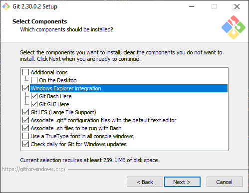

The first option is just to add desktop shortcuts, doesn't matter too much. The second one is entirely up to you, it just adds other ways of using `git`. There's a graphical interface (the GUI) and a command line interface (that's git bash). Everything else you should keep it as I have there, unless you know what you're doing otherwise and disagree with it. It ultimately doesn't matter if you keep the GUI and bash programs, because you can always uninstall them later, and they don't take up that much space.

There's a lot of options, so I'll walk you through them all, next is the default text editor, just keep it as default (which is `Vim`). For the page asking about branch names, also keep it as default (which is `Let Git decide`). When asking about PATH, keep it the same as well (the second option, the one marked `recommended`). Next is asks about `ssh` and `ssl`, you can keep those at the defaults too (`OpenSSH` and `OpenSSL`). For reference, the others options for all of this are purely for people who **really** know what they're doing. I personally use all default settings other than the page I had shown above. It's then going to ask about `end of line commit style`, this doesn't matter, just keep it default so it's not confusing. The `terminal emulator` can be default too, we won't be using it so that doesn't matter. As for default behavior of `pull`, keep it as `default`, since that's what 99% of people use. Next choose the default `credential helper`, for me it's marked as `new`. Almost there, next is extra options, `system caching` is a good idea, especially since you can always clear it if you need to. Go ahead and keep `symbolic links` off, it can get confusing. Finally, the last page, don't enable *any* experimental options, especially since we're still learning. Now you can install it, hopefully you made it through the install unscarred. 

## How do I use it?
Now there are a *lot* of ways to actually use `git`. There's the traditional way using `git bash`, which involves a command line interface, there's GitHubs `GitHub Desktop`, which is a graphical program that helps you do all of this. The way I'm going to be showing you, is using the text editor `vscode`. `Vscode` is a text editor with a ton of extra features made by Microsoft, and as of 2020, it's what FRC wants you to use. It also happens to be my favorite way to code, but my decision is ultimately because all of the guides from official FRC sources are about `vscode`. So that is what I will be using.

I'm going to show you a snippit of `exercise-7` that I've intentionally left some things out on. The two files I'm going to be looking at are `Main.java` and `Shape.java`. Here is what they look like right now:

Here is `Main.java`:
```Java
class Main
{
    public static void main(String[] args)
    {
        ShapeController.run();
    }
}
```

Here is `Shape.java`:
```Java
class Shape
{
    double getArea();
    String getShapeName();
}
```

Hopefully you see what's wrong in each file, but I'll explain it if not. In `Main.java`, we're trying to use the `run()` function without an object. This is what's known as a `static call` to a function. But our `run()` function isn't static, so we need to create an object of `ShapeController` first. In `Shape.java`, neither the class, nor the methods are marked as `public` or `abstract`. I'm going to go ahead and make those changes, and show you how I would update those in the remote `GitHub repo`.

Let's start with downloading a repo onto our computer. Once you have `vscode` open, you want to open the `command menu`. This will be something you use quite a bit, so it's best to learn the shortcut now. To do this, you use the keyboard shortcut: `ctrl + shift + p`. It will then open up a little drop down menu, it start with a `>` but don't delete that, that's how vscode knows you're trying to perform a command. Once that's open type in `clone` or `git clone`, it's a search so it will probably find it, then select `Git Clone`. It should look like this before you hit `enter` on it:
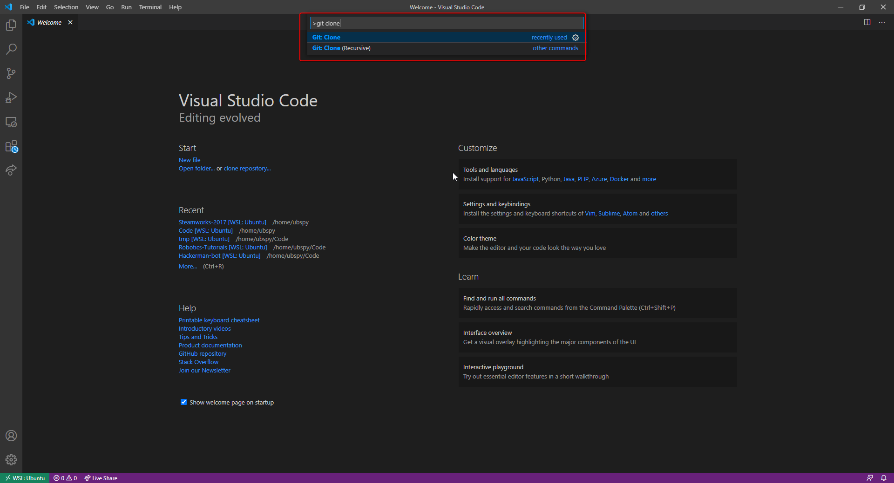

Once you've pressed enter, it will ask you for a repo link. It's not that hard to get it, any `GitHub` repo has a link, and it's really easy to find it. For an example, I'm going to use the `DeepSpace-2019` repo on the `SargonRobotics` github account. If you go to the [webpage for this repository](https://github.com/SargonRobotics/DeepSpace-2019), you can find the link by doing what's shown below (this works for any repository):


Once you have it pasted in, it will ask you where to put it. The way `git clone` works, is it automatically creates a new folder, so there's no need to make your own separate folder for the `repo`. For example, if you clone it to your desktop (not the best idea, but it works), it won't have all the `.java` files sitting there, it will make a folder (in our case, called `DeepSpace-2019` on the desktop, and everything will be in there). Then it will ask you to open that up, go ahead and do that.

Now I have a repo made for the `exercise-7`, and I'll show you how to actually `add`, `commit` and `push` the changes I talked about before. Once the changes have been made, we need to go ahead and `add` the files first. To do that, first navigate to the `git` tab in vscode, you can find it by clicking right here:


Now here it will show your changes, but if you've made changes and they aren't showing up, just click the refesh button:
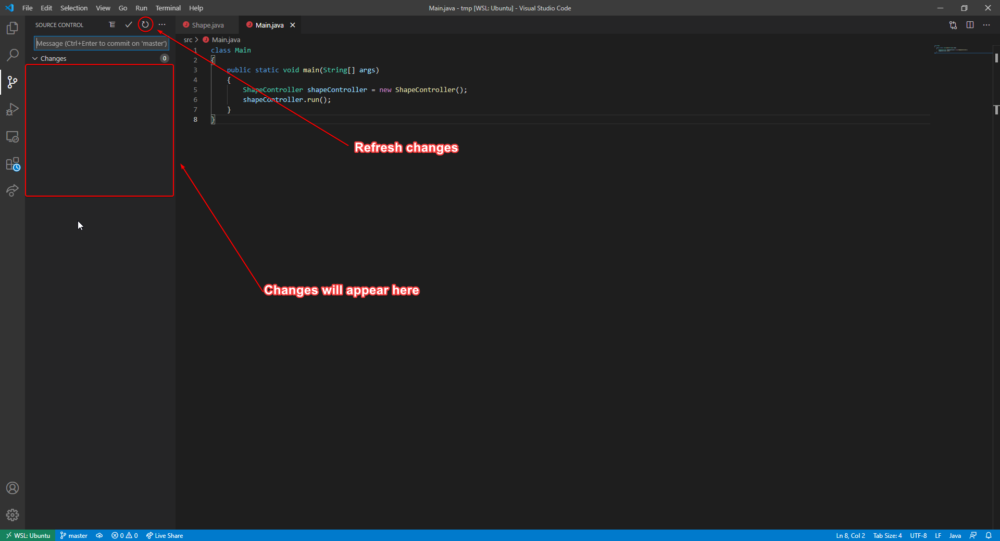

Now you'll see your changes! Each file will have a set of changes, and if you see, I've clicked on `Main.java` so you can see what changes exactly I made, this is also helpful for when you're writing your `commit message`, because sometimes you forget everything you did. The `M` next to the files means that those files were `modified`. There's two other things it can be, `adding` a file (will have a green `A`), or `removing` a file (will have a red `R`). I'll go ahead and show you some of the buttons you can press:
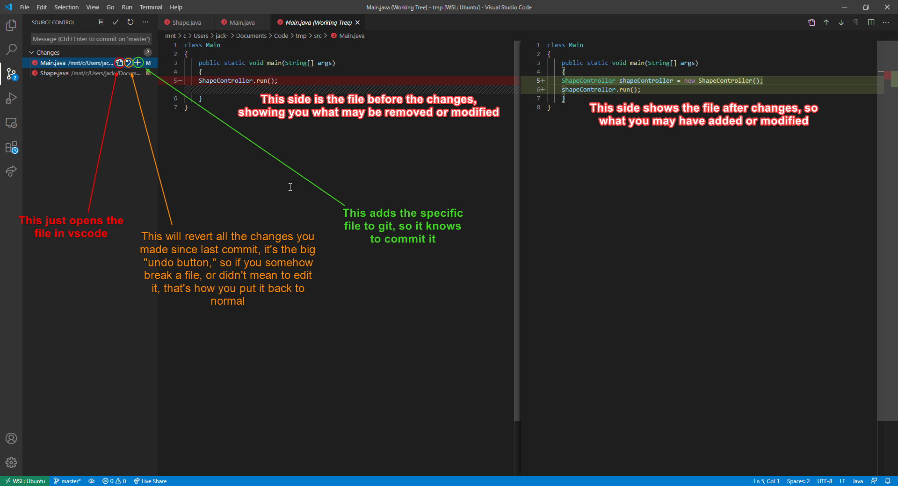

You can also where it says `Changes` and add, or revert all the files there. That's what I'm going to go ahead and do:
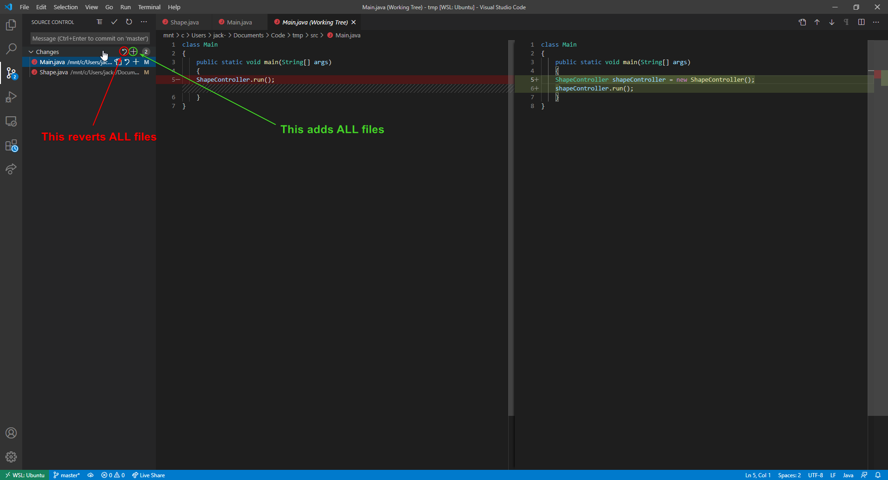

Now that we've added our files, let's `stage a commit`. All we need to do for this, is type the commit message in the box, and then hit the `commit` button:
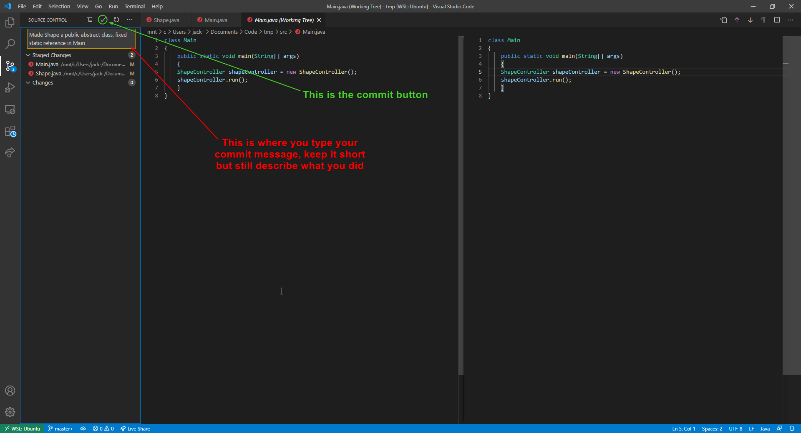

There you are! There's a couple more things about using `git` in `vscode` that I'm going to mention, because we're not completely done. First is `pushing`. I can't show you because I don't have a remote repo set up, so I can't show you, but there's a button for it. It will also tell you how many commits you are either ahead or behind the local repo, so you know if you need to `push` or `pull`. The button for pushing and pulling will be right here, but will have a different icon for you since you'll have a remote repo:
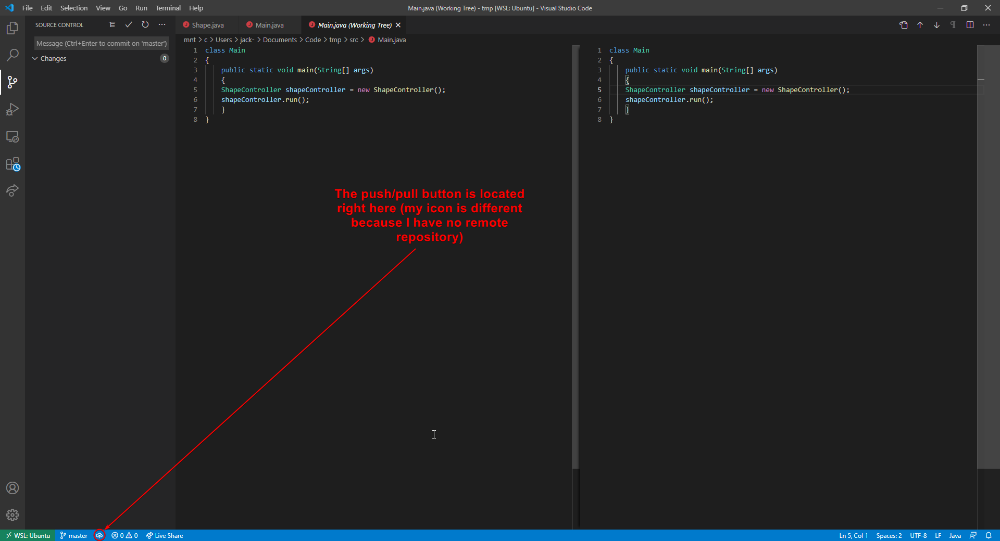

When you do this, it may ask you for your `GitHub` login, there's ways to avoid doing that every time, but considering you'll probably be using computers that belong to the team, not you, just login on push for now.

There's one more thing I want to talk about, and that's `using branches`. There is a `branch` button, that allows you to easily switch between branches as well as make new ones:
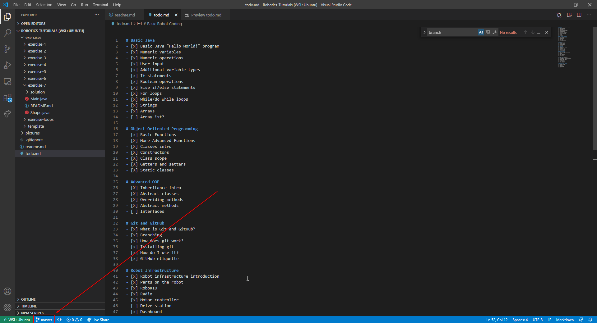

There's also a large set of other options, you don't need to worry about a lot of that, but it *is* how you merge. You can push and commit from there also if you want:
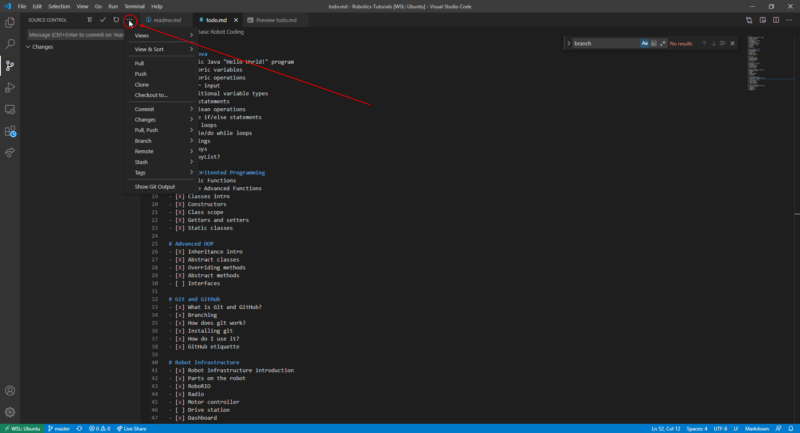

## Github etiquette
Now that you understand how to use `git` and what `GitHub` is, let's talk about some etiquette. These are sort of like variable naming schemes, sure you don't *need* to follow them, but please do. There are good reasons for what I'm going to talk about, and I'll mention it as I go along. The first big rule of thumb: `never commit directly to master`. I alluded to this before, but the master branch should always contain the last bit of stable code. If you want to make any changes, you don't want anyone else trying to start a new feature to make a branch from master when the commit you did broke the code in master unknowingly. So what do you do if you want to make a change? Well if you want to work on a new feature, like start drive code, you almost always want to make a new branch. The only time you should *ever* commit to master, is if your master branch currently isn't stable, and that commit will fix it. Ideally though, if you use branching right, that doesn't happen.

The next thing is called a `pull request`. This is actually specific to `GitHub`. I've already expressed the importance of the `master` branch, and how we shouldn't directly commit to it. There's also an unwritten rule about never merging directly to master. How do we not merge directly to master? Well we use something called a `pull request`. To do this, you open up the webpage for the `GitHub repo`, you go to the `pull request` tab and create a new one. Once you're there, you pick which branch you want to merge into master, and then you `create the pull request`.

After that, you create something describing your changes, and then other people can review it. This is nice because it's always really easy to miss some things when you're actually coding, so someone else can go over your code and if they see anything big, they can leave a note at a specific line in code describing the problem. Then once its approved you can actually merge it. The owner of the repository can actually force people to have at least one or two approvals for any merge request into the master branch. This isn't 100% something you need to do for FRC, especially considering the time crunch that build season tends to be. It's some good practice though for people trying to learn, and if you can fit it into your work flow I 100% recommend doing it.

# Robot Infrastructure
This section isn't about the robot code, but more about the parts that make the robot work, as well as how to set them up properly. Unfortunately, you can't just get into coding an FRC robot with the parts out of the bad, you have to set them up. Additionally, I want to clarify that from now on, everything is subject to change. While robot parts aren't super likely to change, it does happen. In 2014, they did a radical overhaul of the robot systems, and at any time, they can do it again. If they do any big changes, hopefully someone will bring up an issue so I can address it and try to change it, but nothing is certain. All if the information you will need can be found on [WPI's Website](https://docs.wpilib.org/en/stable/). Unfortunately, that link can also change, but googling `WPI FRC` should hopefully get you there!

## Parts on the robot
I want to cover really quick some essential components on the robot. There are some components that need some software installed on them before we can start using them, and it's usually the job of the programming team to do that. I won't be going over every component, if you want you can look at WPI's webpage and they have a detailed guide on all the components, but you should know how the robot works on a fundamental level before getting into it.

## RoboRIO
Let's start talking about parts on the robot. I won't be covering all of them, in fact this won't even be close, if you're curious you can check out [this link]() for more info on robot wiring. The main component of the robot is called the `roboRIO`. This is the brain of the robot, and when we actually deploy our code, that's where it goes. If you look at the component itself, it has a ton of ports on it, the wiring team will connecting them all (or you can learn if you'd like), but those are how we communicate with all the other parts on the robot, like the motors, the lights, and even the computer we control it with. When you first get a roboRIO out of the box, it's not just going to work, you'll need to `image` it. `Imaging` the `roboRIO` is basically the same thing as installing an operating system on it, except with a little more. Each year they come out with new images, so you want to keep it up to date when you can. WPI has a [pretty good guide](https://docs.wpilib.org/en/stable/docs/zero-to-robot/step-3/imaging-your-roborio.html) on this, but I'll explain a the basics here. You want to get a computer that runs Windows, and then you want to open up a program called `roboRIO Imaging Tool`. This is a tool that comes with the `Labview FRC Software` which we install each season. If you don't have that installed on any computers you're using for your robot coding, you might want to see if you can get a key from someone on your team, or use a team dedicated machine that will have it. Then you want to connect your laptop to the `roboRIO` using a USB-A to USB-B cable, unlike other options, when imaging it's essential to use a USB interface. The ability to network using an ethernet cable is part of its image, so using a USB is the only way to fully image it. You also need to be powering the `roboRIO` to be able to image it, the USB cable does not provide enough power to keep it on. There are three options once you open it, there's `edit startup settings`, `format target` and `update firmware`. Each time a new season comes out you want to make sure to `format target`, then `update firmware`. Using `format target` will allow you to get all the new features of the upcoming season. `Updating firmware` will make sure that all the ports used for communication are working as best as they can be. Other than that, there's nothing else you need to do other than put your code on it.

## Radio
The `radio` is another essential component of the robot, and it's very particular to programming. The `radio` is how we actually communicate with the robot when driving. It's essentially a `router`, it creates a wireless network that your `drive station` can connect to so you can drive it wirelessly. It's also how you can deploy code wirelessly. You might be thinking "why do we call it a `radio`, and not a router?" Well a `router` is supposed to take in another connection and then spread that network to your devices, at your home your `router` is taking in the big network of computers which comprises the internet, and allowing your home devices to connect to it. The `radio` on the robot does no such thing, it's an `isolated network`, meaning it doesn't communicate with anything except for whatever is directly connected to it. When you first get the radio, as well as at the start of each new season, you will need to `program your radio` for robot usage. WPI has another [excellent guide here](https://docs.wpilib.org/en/stable/docs/zero-to-robot/step-3/radio-programming.html). But it's really similar to the `roboRIO imaging`. While the radio is on, plug your laptop into it via an ethernet cable, will our your team number and whatever else you may need, and follow the on screen instructions.

## Motor controllers
This one is *much* shorter, but I wanted to talk about it for a second, because we will be using these very soon. Now motors take a lot of power, like **a lot** of power. We don't want to have to route this power through our `roboRIO`, because it can easily fry the microchips inside. Also, our power source is constant at `12V`, we want a way to be able to give the motor less so it's not always spinning at max speed. This is where our `motor controllers` come in. They take 3 inputs: the positive and negative terminal for power, and a `signal` from the `roboRIO`. This signal will be generated by the code we write, and the `motor controller` is designed to give more or less power to the motor depending on the signal it gets.

There's some important stuff to know about it, first there's the lights on the motor controller will change with what they're supposed to be doing. This can be helpful when the `motor controllers` aren't acting as they should be. Each one is different, but on the user manual for the `Victor SP`, this is the information they have on the lights:
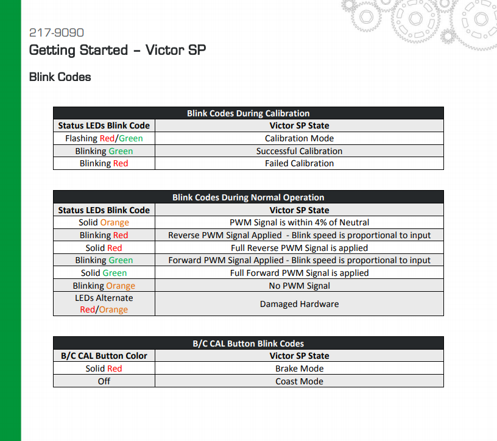

You can look up different `motor controllers` to see what all the colors mean. The other important thing about them is `calibrating them`. For the most part we won't need to worry about it, but sometimes you want to `recalibrate` the `motor controllers`. What does that mean? Well it tells the motor controller which signal values to use as the minimum, the zero, and the maximum. The `minimum` just means the highest speed in the reverse direction, `zero` means when the motor shouldn't be moving, and `max` is the highest speed in the forward direction. If you notice the motors aren't spinning correctly, or spinning when your controller isn't being pressed, you might want to `recalibrate` them. As always, you can look up how to do that based off which `motor controller` you have. The `Victor SP` has this on their `calibrate` section:


## Drive station
These last two are not part of the robot, but they're essential to driving and testing the robot. The `drive station` is just a computer running the software to take controller input, and send it to the robot. I want to have a basic overview of the driver station software, since it's pretty important. Here is what it will look like when you first start it up:
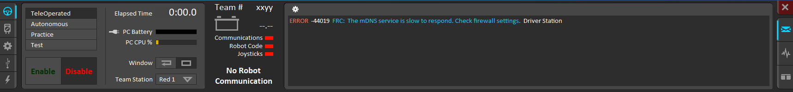

On the very left, there are 5 tabs. We'll go through each of these 1-by-1, right now we're on the `Operation` tab, which is the main one. Next you can see there are several robot modes, there's `teleop`, `autonomous`, `practice` and `test`. The `teleop` mode is when you're controlling it with a controller, like you would in a match. The `autonomous` mode is when the robot controls itself, this would happen in the first 15 seconds of a match. ADD DESC OF LAST TWO.

Below there are two big buttons for `enable` and `disable`. The robot can only move when it's `enabled`, so if your controller input isn't working, make sure it's enabled. There's also two important keyboard shortcuts. If you press the `Enter` key, it will disable the robot until you re-enable it. If you press `space`, it will cause an **emergency stop**. This will disable the robot, and not allow it to be re-enabled until both the robot, and the driver station software are rebooted, so only used it in emergencies.

Next is just some nice information: how long the robot has been enabled, your PC battery and how much CPU is being used. There's also a way to change how the windows behaves, and to set which station you're using (not too important most of the time).

After that is some robot information, from here on won't change when you change tabs on the left side of the program. First is your team number (for now it's `xxyy`, which is the default, we'll manually set that soon). Then it will show the status of the battery, and there's three status indicators. `Communications` means that the driver station can communicate with the roboRIO. If you're connected to the radio, but that's not on, make sure the roboRIO is properly configured and connected to the radio. Next is `Robot Code`, if this is red, just re-deploy your robot code. Last is `Joysticks`, which tells you if any joysticks are connected to the driver station.

The last part is the console output. This will show you errors in the robot code, as well as any warnings or print statements. This means if you have `System.out.println` in your code, it will show up there. If you click on the gear at the top of the console, you can set it to show only errors, errors + warnings, or everything. You can also enlarge the console, and look at the `log file` for the robot. This keeps track of how much power is being by the robot on each component.

On the very right, you can change the tabs into two other modes. The middle tab is the `charts`. This shows your robots battery voltage, as well as packet loss. Packet loss is the amount of packets the driver station sent to the robot, but didn't get processed, the lower this is, the better. The lowest tab shows both the console and the charts. 

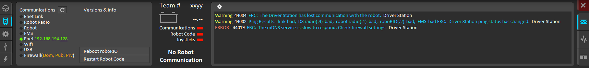
This is the `diagnostics` tab, it shows what you're conneted to. `Enet link` is ethernet, it checks your computers ethernet port. `Robot radio` is, well the radio. `Robot` is the roboRIO. FMS is the `field management system`, this won't be on unless you're at competition. The last 4 are just different network devices you can connect to the internet with.

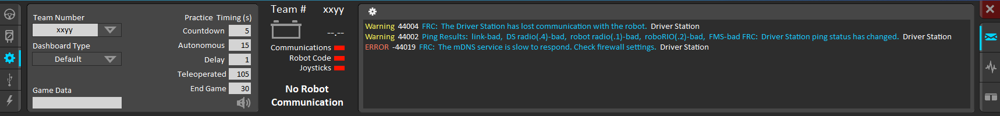
This is the `setup` tab. This is where you set your team number. You can also set your type of dashboard, my personal recomendation is `SmartDashboard`, but you use what ever you think works best. Then on the right, you can set timings for the `practice mode`, which is default to what a real match would be.

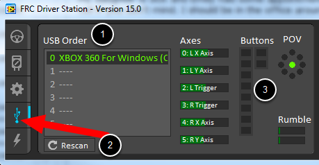
This is the `input` tab. This will show you all of your controllers you have connected. Now I tried for about three hours to get my xbox controller to connect to my virtual machine and show up in the `Driver Station`, but it just didn't want to. So this is someone else's picture. Under number `1` is a list of controllers. Most of the time, as long as you only have one controller plugged in, it will be in the `0th` slot. Sometimes it likes to think you still have a different controller plugged in, but you can change around the order by clicking and dragging. Under number `3` is all the buttons and axes. When eventually ask for button and axis numbers, this is how you can find them. Just move the particular axis, or press a particular button, and you can get its number from there.

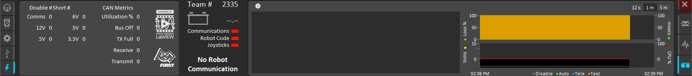
This is the last tab, the `power` tab. This tab isn't too important, but it shows you how much power is being used by different things.

There is a lot more depth to this software, but I wanted to give a general overview of it before we went on.

## Dashboard
The `dashboard` is a software the accompanies the `drive station` software. What it does, is display stuff from your robot code that we ask it to display (such as the camera, or motor values for debugging). There's not a whole lot to how the dashboard works, there's two main ones: the default labview one, and `Smartdashboard`. I personally recommend using `SmartDashboard`, because you can move elements around, and only display what you need to. When we get to code, I'll talk about how to put stuff on there, but using either dashboard software is pretty intuitive. Setting your default dashboard is just an option of the `drive station` software. 

# Basic robot coding 
You've made it. You got through basic Java, learned OOP, inheritance, and gone through some basic robot infrastructure to help you understand the robot a bit better. It's now time to learn about robot coding. You've made it so far and you probably don't even realize it. Now unlike all the code you wrote for me so far, you won't be coding a robot completely from scratch, there's a lot already working for us. We use `libraries` from WPI for the robot. What is a `library`? It's just importing someone else's code. In this case, FRC has a bunch of code that is used to talk to the roboRIO, and use all of its ports to talk to the other components. This means, all the hard work is done for us, making a motor turn is as simple as calling a function! Additionally, a lot of the robot code has its own structure. The robot code runs off something called a `scheduler`. This is a bit of code that handles the timing on everything, and calls appropriate functions. I'll get into more specifics in the appropriate section, but coding on a robot is different from our "normal" coding. The biggest difference is that the robot code is continuously looping. This is the main reason we avoid `for and while loops`. Sometimes a for loop is necessary, but to be honest with you I've never used one while coding a robot. And `while` loops should be completely avoided. Anyways, let's get into coding for a robot!

## Setup
Just like `git`, there's some setup that needs to be done. I'm not giving you a step by step, because they have [their own setup guide here](https://docs.wpilib.org/en/stable/docs/zero-to-robot/step-2/wpilib-setup.html). There's other software they tell you how to install, but for coding you only need that link. The `FRC Gametools` do need to be on one computer, because that's how you image the roboRIO, configure the radio, and actually drive the robot. But for coding this is the only link you need.

Why do we need to install separate software? Well this will install all the libraries you use, this code doesn't come from nowhere, it actually needs to be installed on your system. Another thing, is that the roboRIO is a different architecture. If that means nothing to you, it's basically an entire different processor type. All laptop and desktop computers use the same architecture (x86_64), but the roboRIO is an ARM processor. This means we need extra tools to be able to compile code specifically for that type of processor. Once you have that all set up, it's time to make your first project!

If you remember how to open the `command menu`, we'll need to open that. For those of you who forgot, it's ok! The shortcut is `ctrl + shift + p`. Now there will be a lot more commands since we have stuff for C++, Java and now FRC. What you want to do is type `WPI:`, that will filter the commands for stuff related to FRC robot programming. Then after that, type in `new project`. You should get something that looks similar to this:
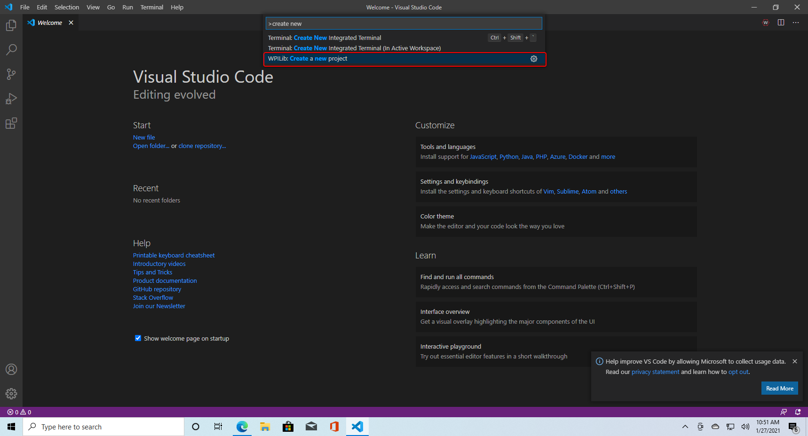

Now it's time for the settings. Promise this one is much shorter than the `git` install settings. Here is the menu that will pop up:
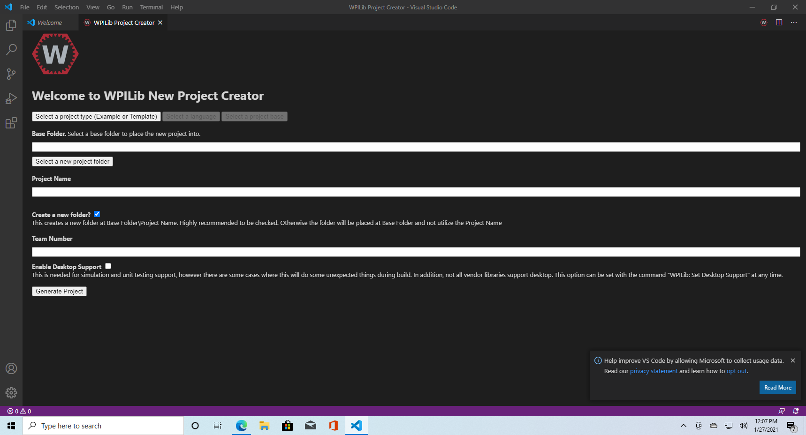

First, you want to select your project type. Your choices are between `example` and `template`. `Example` would be used if you want to see WPI's examples on a particular bit of code, like if you wanted to see drive code or something related to PID. When starting new robot code, you'll want to use `template` pretty much always. You then have to pick your language. Hopefully by now you know which one we're using. Then we select a project base. Then you select your project folder, give it a name (please do not put spaces in the project name, it will break everything), you pick if you want vscode to make a new folder, and you enter your team number. Unless you know what you're doing, just keep `enable desktop support` off. Especially since this can be changed later. Then click on `generate project`. Congrats! You have a robot project now!

When you first create the project, vscode will have a lot of stuff to do. Just let it go until it's done, we don't want to worry about any of it, WPI did all the work for us.

## Timed robot coding
Ok we have code now? What do we do? Well let's talk about what we actually need to look at. The only things you'll be changing for the most part will be in the `src` folder. `Src` stands for `source`, and is where the `source code` of your project will lie. There's two folders in `src`. There's `deploy`, and there's `java`. As you can probably guess, all of our Java code will go in the `java` folder. The other folder is there for more complicated reasons. If there are like config files you want to upload to the robot, you put them in the `deploy` folder.

As for what files you want to worry about in the `java` folder? Well first rule of thumb is **do not touch Main.java**. If you want, you can edit the formatting, like I do, but do not change any code in it. Everything we will be editing will be in the `Robot.java` file for now. Once inside the `Robot.java` file, there's a lot to look at. We're just going to go one by one. The first thing you'll notice is they format their classes and functions like:
```Java
public class Robot extends TimedRobot {

}
```
Instead of what we're used to:
```Java
public class Robot extends TimedRobot
{
    
}
```

This is purely personal preference, but I like to change all the stuff to look like it is below. I'm going to walk through the file and explain most of what is there. The first thing you'll notice is something alone the lines of:
```Java
package frc.robot;

import edu.wpi.first.wpilibj.TimedRobot;
import edu.wpi.first.wpilibj.smartdashboard.SendableChooser;
import edu.wpi.first.wpilibj.smartdashboard.SmartDashboard;
```

The first line just sets a Java `package`. This is essentially just the folder it's in. I wouldn't worry too much about it, since the `WPI` extension will handle all of this for us. Then there's the `import`. Remember before when I talked about using `libraries`, well we're importing classes from other `packages`. For example, `edu.wpi.first.wpilibj.TimedRobot` is a package, and we're importing it so our class `Robot` can inherit from it. If that looks scary to type, don't worry, vscode handles import for us with the right hotkey.

Then we get to the class definition, which should look ok. We're making a public class called `Robot` that inherits from `TimedRobot`. Then we come to this bit of code:
```Java
private static final String kDefaultAuto = "Default";
private static final String kCustomAuto = "My Auto";
private String m_autoSelected;
private final SendableChooser<String> m_chooser = new SendableChooser<>();
```

Most of this should look ok. They make two final strings (and that's why we initialize them outside of the constructor, because we can **only** set their value here). You might be asking "why do they name is `kDefaultAuto`. I have no idea if I'm being honest. It might mean `constant`, but normally we put constant variables in all caps. Good news if you can always change the variable names. The next thing is the `SendableChooser`. This one is probably a little confusing. `SendableChooser` is a class made by `WPI`, and it's something that gives us a multiple choice option in our `SmartDashboard`. This would be like if you wanted to start the robot by going forward, going forward and turing left, and going forward and turning right, you can pick just one. Now the good part about the `SendableChooser` class, is we don't need to know a thing about the code inside. Since it was made properly, we only need to worry about what functions we'll need to use.

Before I continue, I should talk about `templated classes`. That's where the `<>` comes from. All this means, is when we create a `SendableChooser`, it needs to know what each entry is going to be. In this case, we want to display text like `Stay Still` or `Go Forward`, which is a `String`. That's why we have `String` inside the angle brackets `<>`. That's all you really need to know.

Additionally, they choose to name it `m_chooser` instead of `_chooser`. Both are find, I leanred to do it without the m, so I like to change it.

Now we have a plethora or functions, I'm going to explain what each ones does in a brief manner:
Function                            | Purpose
----------------------------------- | -------------
public void robotInit()             | This server as your `Robot` class constructor. What happens is the constructor for the superclass `TimedRobot` calls the `abstract function` called `robotInit()` so treat it as your constructor. Note: **do not make a `Robot` constructor**
public void robotPeriodic()         | This will loop periodically (about every 200ms) while the robot is on. There's honestly not much use for this, since you can't move any motors or get controller input unless the robot is `enabled`, but it's there if you need it
public void autonomousInit()        | This will run one time when the robot is `enabled` in `autonomous mode`, which means there is 0 controller input.
public void autonomousPeriodic()    | This will loop periodically (about every 200ms) when the robot is `enabled` in `autonomous mode`
public void teleopInit()            | This will run one time when the robot is `enabled` in `teleop mode`, which means you're operating it remotely using a controller input
public void teleopPeriodic()        | This will loop periodically (about every 200ms) when the robot is `enabled` in `teleop mode`
public void disbledInit()           | This will run one time when the robot is `disabled`
public void disabledPeriodic()      | This will run periodically when the robot is `disabled`. I have literally 0 idea what this is for, but it's there
public void testInit()              | Hopefully you can guess what this does, it runs once when you enable `test mode`
public void testPeriodic()          | This will loop periodically (about every 200ms) when the robot is `enabled` in `test mode`.

There you are, those are all the main functions inside of our `Robot` class, and when to use them. For the most part, we will be coding in the `teleop` stuff for now. Down the line we can move onto others.

## Documentation
Moving along the `Robot.java` file, you can see we have some pre-generated code in the `autonomousInit()` function. Let's take a look:
```Java
m_autoSelected = m_chooser.getSelected();
// m_autoSelected = SmartDashboard.getString("Auto Selector", kDefaultAuto);
System.out.println("Auto selected: " + m_autoSelected);
```

What is `m_chooser.getSelected()`? Well I won't be here to explain every function, luckily there is documentation! If you go to the [WPI FRC Java documentation](https://first.wpi.edu/wpilib/allwpilib/docs/release/java/index.html), and search for `SendableChooser`, you should be able to look at all the functions and what they do, including `getSelected()`. If you look for the function (also called a method), you'll see they tell you it returns type `V`, which just means what we set it to on creation, or in our case, a `String`. It also shows the name, as well as a description of what it does. So in the `SmartDashboard`, if you pick the option labled `"No movement"`, then `getSelected()` will return a String with the value `"No movement"`.


You'll notice I skipped over `robotInit()`, that was semi-intentional, there's three new functions there, and I wanted to explain `documentation` fost. See if you can use the documentation to find out what the function for `m_chooser` inside of the `robotInit()` function does. It should be self explanatory because of the function names, but it's good practice. As for `SmartDashboard.putData()`, first you'll notice that it's a static function, since we didn't need to make an object. But all it does is add something to the `SmartDashboard`, in those case it's the `Chooser` so we can pick which autonomous mode to start with.

The only thing left to analyze is the code inside of the `autonomousPeriodic()` function. We're almost there:
```Java
switch (m_autoSelected)
{
    case kCustomAuto:
        // Put custom auto code here
        break;
    case kDefaultAuto:
    default:
        // Put default auto code here
        break;
}
```

This is just a switch statement, and depending on which autonomous mode is being chosen. If you forgot switch statments, don't worry about it too much. We won't be using that code anyways.

## Port constants
What is a port constant? Well if you've looked at the roboRIO you'll notice there are a lot of ports. Just in the `PWM` section, there's about 10 ports. If we want to assign port number `2` to the left drive motor, you would proably not like to type `2` everywhere. What we want to do is make `constants`. Since we're only working with one file, you can just put them at the top of `Robot.java` for now, but eventually we will have them in their own file. Right now, at the top of the `Robot` class, let's make two constant integers for motor ports. Assuming we have a two wheel drive, we'll have one for the `left motor`, and one for the `right motor`. The ports can be what ever you want from 0 to 9, but I'm going to pick 0 and 1:
```Java
final int LEFT_MOTOR_PORT = 0;
final int RIGHT_MOTOR_PORT = 1;
```

You'll notice I didn't set `static` or `private` like the others. Since right now we're only dealing with one file, there's no real reason to do that. In all honesty, I don't know why they bother to make those `static` if they're going to be `private`, but ours will work just fine.

## Coding motor controllers
It's time! We are not going to make the motor controller objects. Now the type of object you make sill be specific to the motor controllers your robot has, so consult with the mentors to see which motor controller you have on the robot you're coding for. Not all of them have names on them. I'm going to be using coding for `Sparks`, and therefore will be using the [Spark class](https://first.wpi.edu/wpilib/allwpilib/docs/release/java/edu/wpi/first/wpilibj/Spark.html). But lucky for you, all the methods and variables for each motor controller are the same. Since they're all based off of the same `MotorController` class, they can't overwrite the essential behavior of those classes. In other words, each motor controller class will have the exace same methods. First we need to make a member variable for our `Robot` class that will hold the two `Spark` objects. I'm going to do this below the constants, but above `robotInit()`:
```Java
Spark leftDriveMotor, rightDriveMotor;
```

Remember what I told you, we don't want to set their value until the constructor, which here is `robotInit()`. So let's go set those, the constructor only takes the port number and that's all.
```Java
@Override
public void robotInit()
{
    leftDriveMotor = new Spark(LEFT_MOTOR_PORT);
    rightDriveMotor = new Spark(RIGHT_MOTOR_PORT);

    m_chooser.setDefaultOption("Default Auto", kDefaultAuto);
    m_chooser.addOption("My Auto", kCustomAuto);
    SmartDashboard.putData("Auto choices", m_chooser);
}
```

There you have it, now we have some motor controllers. How do we actually use them? Well you've probably noticed by now that `vscode` is offering you suggestions on what you can type in. If you type in `leftDriveMotor.`, and then use the auto-complete shortcut `ctrl + space`, you'll get to see all the member variables and functions that are a part of that class, once that menu opens, you can use the arrow keys to navigate it:
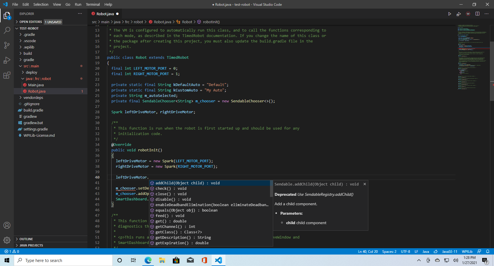

The function we really want to worry about is `set`. You can set it to any value and the motor will spin. The range on the numbers is from -1 to 1. `-1` is the fastest the motor will go in the reverse direction, and `1` is the fastest it will go on the forward direction. As you probably guessed, `0` is stopped. Let's go into the `teleopInit()` function and set both motors to move forward at a quarter speed. Why not the periodic? Well we're just setting them to go when we enable, and we don't change it, so that's why we put it in init. When we get controller input, we'll want to change that:
```Java
@Override
public void teleopInit()
{
    leftDriveMotor.set(0.25);
    rightDriveMotor.set(0.25);
}
```

I wouldn't recommend running this robot code, because having motors just spin with no button to stop them is dangerous, but it shows you how to set motor controllers. You might be wondering `what if we want to stop it?`. Well when we `disable` the robot it automatically stops everything from moving, but let's go ahead and code it in to stop them anyways. For this, you can either use `set(0)`, or there is a `stopMotor()` function. I like to use the `stopMotor()` function. Go ahead and try it yourself, see if you can figure out which function that would go in:

<details>
	<summary>Here is what I have:</summary>

```Java
@Override
public void disabledInit()
{
    leftDriveMotor.stopMotor();
    rightDriveMotor.stopMotor();
}
```
</details>

Now you know how to set motors! You're coding robots!

## Controller input
Obviously, just setting the motor to `just go forward and don't stop` is bad for multiple reasons. First of all, it's not safe, just tell the robot `yeah no don't worry about hitting anything`. Furthermore, it's not as fun, wouldn't you want to actually *drive* the robot? Well lucky for you, that's what we're doing next!

Now getting controller input is entirely handled by the [Joystick class](https://first.wpi.edu/wpilib/allwpilib/docs/release/java/edu/wpi/first/wpilibj/Joystick.html). With this, you can get all the input, as well as (depending on the controller of course) activate lights on the controller, or rumble it. Now let's start like we did last time with having a class wide `Joystick object`, and we should initialize it with a constructor. I want you to try and do this yourself, now the constructor only takes one argument, and that's the number of controller on the driver station. If you remember the controller section, all of your controllers will have a number next to them:

PUT PICTURE HERE

This number is what goes in the constructor, and it's entirely dependant on how many controllers are plugged in. So if there's only one controller plugged, it will have the number `0` every time (unless the driver station messes up, which is something that happens). So when you initialize your `Joystick object`, your constructor parameter should be `0`. Go ahead and try it yourself.

<details>
    <summary>Here is what it should look like:</summary>

```Java
Joystick xboxController;

@Override
public void robotInit()
{
    xboxController = new Joystick(0); // Controller port 0
    leftDriveMotor = new Spark(LEFT_MOTOR_PORT);
    rightDriveMotor = new Spark(RIGHT_MOTOR_PORT);

    m_chooser.setDefaultOption("Default Auto", kDefaultAuto);
    m_chooser.addOption("My Auto", kCustomAuto);
    SmartDashboard.putData("Auto choices", m_chooser);
}
```
</details>

If you took a look at the documentation for the `Joystick class`, you should hopefully already be understanding how this works. There are a ton of `getter functions` that you can use to get the different inputs of the controller. There's two main functions we will be looking at for now: `getRawAxis` and `getRawButton`. These are not a part of the `Joystick class` itself, but part of the `GenericHID class`, which `Joystick` inherits from. As you can imagine, `getRawAxis` will the the real time value of a particular joystick axis, and `getRawButton` will do the same but for a button. For these, you need to give the particular number for the axis or button you want.  Now your team may have different controllers at their disposal, but I will be using an xbox controller, and there's a popular chart showing which buttons and axes have what numbers:
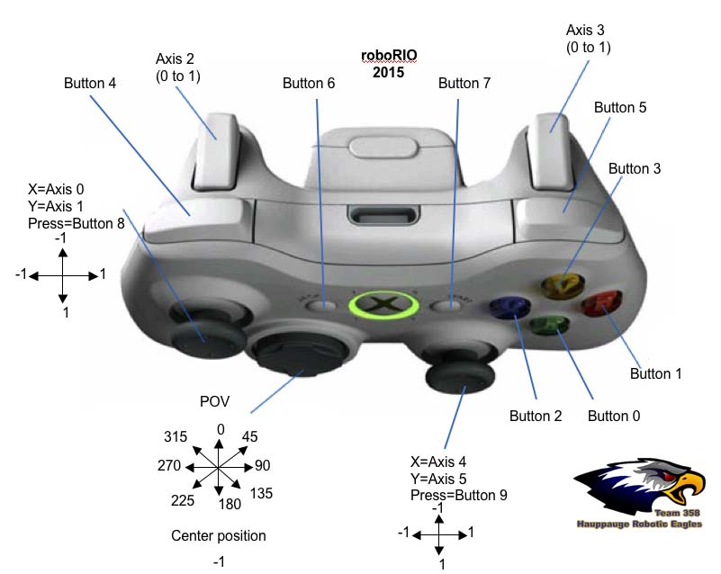

But you can also figure that out in the driver station software, by moving the axes you want, or pressing the button you want, and look at the number there. Those will be the same numbers in the code.

So, now that we have the joystick object, let's get the joystick values and store them in a variable. Inside our `teleopInit` function, I'm going to add this line:
```Java
double moveVal = xboxController.getRawAxis(0);

leftDriveMotor.set(moveVal);
rightDriveMotor.set(moveVal);
```

This will now make the robot go forward and backward depending on your controller input. On a real robot, there's a chance that when you press forward on your stick that one of the motors is going the wrong way. Let's say in this case I press forward on the joystick, both motor controllers are lighting up green, but the left wheel is spinning backwards. We should tell the code that that motor needs to be inverted. This is pretty easy to do, since there's a method just for that:
```Java
leftDriveMotor.setInverted(true);
```

I would personally do this in `robotInit` right after we make all of our objects.

But hopefully this is exiting, we are now taking on controller input, and driving the robot with it! You're actually getting there!